### 原子和分子
生命需要多种元素, 其中有25种是人体必需的元素. 植物必需的元素只有17种.
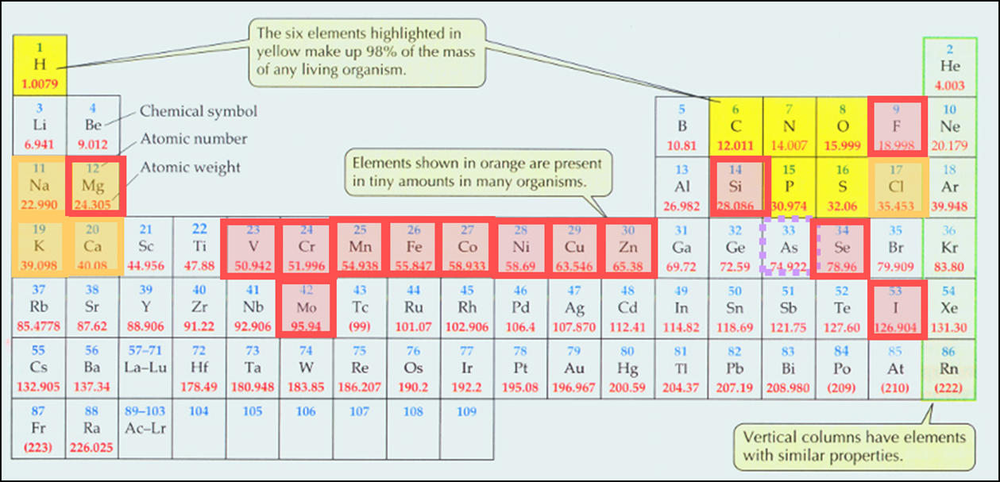

原子电子的得失形成新的化学键, 这就是化学反应. 通过化学反应, 原子组成新的化合物. 生物的新陈代谢是生物体内所有成千上万的化学反应的总称.

微量元素是许多重要生物分子的结构和功能成分. 例如碘是甲状腺素的必要成分, 缺碘会引起甲状腺增生, 又叫大脖子病. 铁是血红蛋白的必要成分.

构成生物体的分子主要有: 水, 无机盐, 蛋白质, 核酸, 糖类, 脂类 等等.
[[01 BiochemistryII - Organic)

#### 水
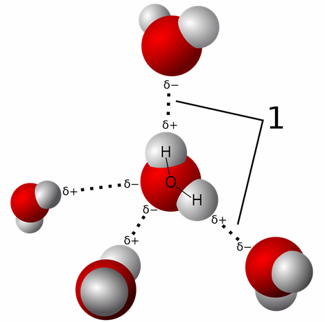
**水是一个高度的极性分子**, 氧具有强大的吸引电子的能力, 因此使氧原子略带负电荷, 氢原子略带正电荷. 因此, 极性分子与水; 非极性分子与水; 两性分子与水, 都能发生一些特别的相互作用, 这些相互作用的效果对生命活动来说至关重要.

- 极性分子在水中的溶解作用, 让水成为很好的溶剂, 可以运载生物体需要的物质, 或者成为化学反应发生的场所.
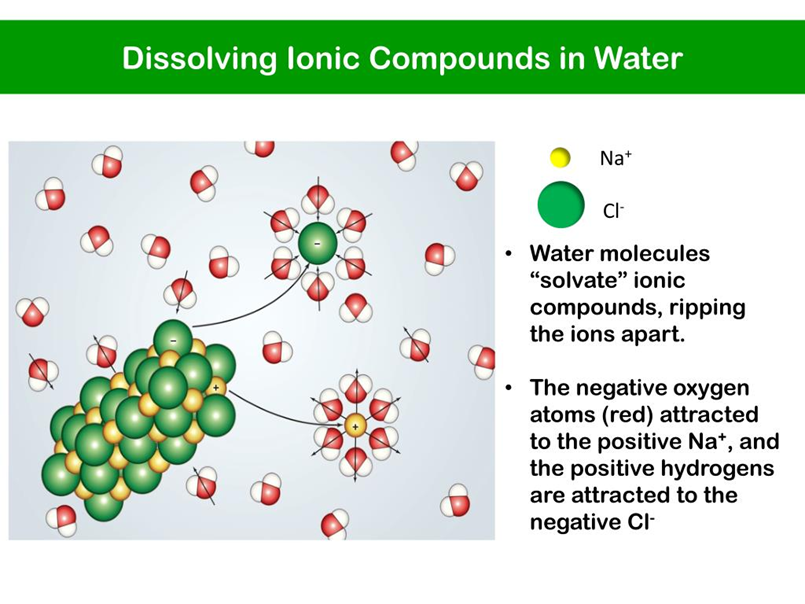

- 非极性分子的疏水效果
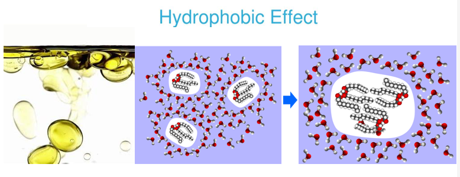

- 两性分子和水的相互作用
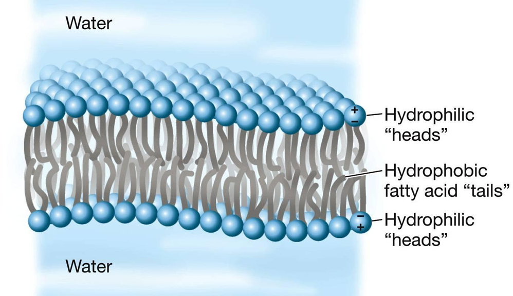

**水分子之间会形成氢键**. 因为水分子的极性, 略带正电的氧原子会和略带负电的氢原子相互吸引, 从而形成一组氢键. 氢键让水分子具有以下的性质:

	- 氢键让水分子具有内聚力, 这是表面张力和植物中水分输送的力量.
	- 氢键能缓和温度的变化, 加热时要先破坏氢键, 才能让水分子运动得快一些. 所以水的比热容较大. 这有利于生物的存活.
	- 氢键让冰比水轻, 因为固体中的氢键是固定的, 所以占的空间较大, 而液体中氢键不断变动, 水分子的密度比较大. 

**水分子能够电离, 产生氢离子和氢氧根.** 生物体中的水总是具有某种酸碱性. 存在一些缓冲溶液(buffer), 能够调节溶液的pH. 但过高或过低的pH依然可能是有害的.
酸雨的pH可达2~3, 是目前全球重要的环境问题.

**水是生命所必需的吗?** 
1954年，英国科学家霍尔丹，在一次座谈会上讨论生命起源时，提出被我们人类这种生命形态利用的水这种溶剂，在某些生命形态下可以由液态氨来代替。他提出的理由是水的一些特性和氨是类似的，比如，以水为基础可以形成甲醇(CH3OH)，而以氨为基础可以形成甲胺(CH3NH2)，甲醇和甲胺这两种化合物正是类似物。霍尔丹由此从理论上提出，有可能以氨为基础建立其一系列复杂化合物的对应体系，比如蛋白质和核酸的对应物质，利用这个体系，整套有机化合物、肽，能够在氨基体系下同样存在。这些作为普通氨基酸替代物的氨基分子能够聚合形成多肽，这些以氨为基础的多肽能够同从地球生命形态中找到的对应物一致。

 这个假说得到了英国天文学家V?阿克塞尔?弗瑟夫(V. Axel Firsoff)的进一步发展，他特别考虑到那些含氨丰富的世界，比如太阳系内(现在还应该包括我们这十几年在太阳系外发现的)那些气态的巨行星和它们的卫星，认为这种生命在那里的发展和进化将是一个非常有趣的课题。

 同水相比，液态氨的确有许多显著的化学相似性。利用含氨的的溶解而不是水的溶解，可以同样提供整个有机和非有机化学反应，液态氨在溶解方面和水一样好甚至更强。同水比，它溶解许多金属元素的能力超好，包括钠、镁、铝等碱金属，可以直接溶解；此外，一些其他的元素比如碘、硫、硒、磷都在液态氨中有一定的溶解度，并几乎不怎么同液态氨发生反应。以上各种元素在生命化学方面都具有重要作用，而且铺就通往生命早期演化的道路。

 液态氨的沸点在一个大气压下是零下34摄氏度，所以这样的生命可能需要在温度比较低的世界里生存，这样的世界并不少，所以这并不是其缺点。但有人认为真正的缺点是液态氨保持液体形态的温区太小，由于凝固点在一个大气压下是零下75摄氏度，所以液态温区的范围仅仅有41摄氏度，还不到水的100摄氏度液态温区的一半。不过，如同水一样，星球表面的大气压提高后将增加液态温区，比如在60个大气压下(这比木星和金星的地表气压低好多)，液态氨的沸点变成98摄氏度而不再是-34度，液态温区也扩大到175摄氏度。氨基生命完全可能是在高压下生存的生命。

氨分子结构

 氨的介电常数大约是水的1/4，使得它的绝缘性能不算好，而另一方面，氨的熔解热更高一些，所以在熔点/凝固点更不容易冻结(凝固)。氨的比热容相当高，比水还高一些，粘滞性则更低。对液态氨酸碱化学反应的研究显示，其细节同水系统一样的丰富。在许多方面，液态氨作为生命承载物绝对不比水差。

 不过，尽管有许多相似性，液态氨系统中碳氨化合物生命的发展路线仍将和我们的水系统中碳水化合物生命有着很大的差异。作为一种承载生命发展的溶剂，不论是液态氨还是水都需要把生命需要的物质溶解形成阳离子和阴离子，从而让酸碱反应得以进行，但同一种物质在液态氨系统和水系统中的酸碱性很可能会是完全不同的。比如，水同液态氨作用会产生NH+离子，并显示出强酸性，结果我们这类生命所依赖的中性的水到氨基生命那里就变成了致命的毒药。对于氨基生命的外星人来说，我们地球一定是个可怕的星球，有着巨大的热酸海洋，还经常下起滚烫的酸雨，他们大概不会对地球感兴趣，不会和地球人发动星际战争争夺地球资源，这样的地狱一样的星球对他们来说还是远离为好。

 所以，我们要明白水和液态氨并不等同，它们仅仅类似而已。两个体系内的许多生命化学特征必定会出现不少差异。例如，莫尔顿(Molton)提出，氨基生命形态可能会使用铯和铷的氯化物来调整细胞膜的电势，同地球生命使用的钾盐和钠盐相比，这些盐在液态氨里面的可溶性更好。看来，铯和铷的氯化物在氨基生命的外星人那里恐怕会是美味的调料，就如同我们人类用氯化钠作为食盐当调料一样。但铯和铷的丰度远不如钾和钠，那里的人们是否会为了美味的调料发动战争呢？这应该是有趣的话题。

#### 无机盐, pH值与缓冲液

- NaCl的作用
	- 维持细胞内外的渗透压
	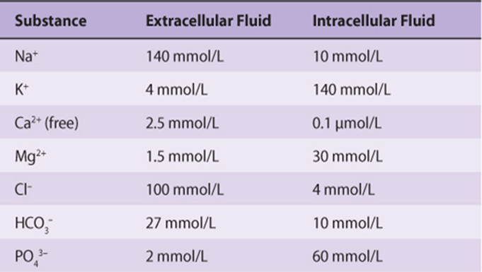
	- 参与体内电性平衡的调节和胃酸的形成
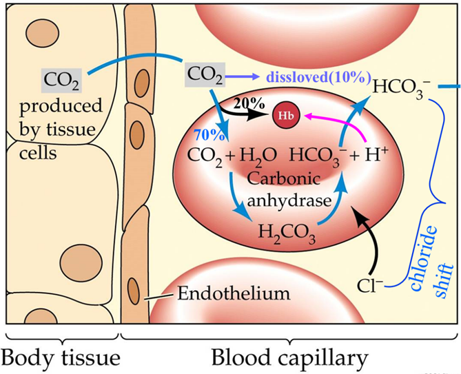
 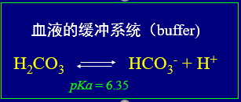
 当碳酸氢根从血红细胞进入血液时,平衡向左移动, 氢离子浓度降低. 这时氯离子要进入血红细胞, 以维持电中性.

 - 参与生物电信号的形成
	**动作电位产生的机制**  
	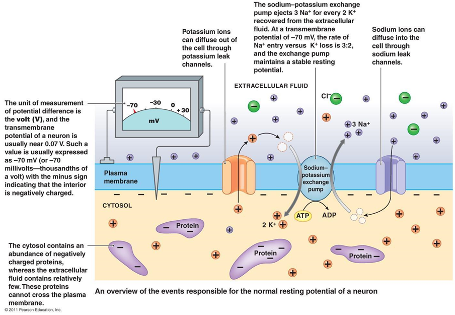
动作电位产生的机制与静息电位相似，都与细胞膜的通透性及离子转运有关。  
l.去极化过程 当细胞受刺激而兴奋时，膜对Na+通透性增大，对K+通透性减小，于是细胞外的Na+便会顺其波度梯度和电梯度向胞内扩散，导致膜内负电位减小，直至膜内电位比膜外高，形成内正外负的反极化状态。当促使Na+内流的浓度梯度和阻止Na+内流的电梯度，这两种拮抗力量相等时，Na+的净内流停止。因此，可以说动作电位的去极化过程相当于Na+内流所形成的电一化学平衡电位。  
2．复极化过程 当细胞膜除极到峰值时，细胞膜的Na+通道迅速关闭，而对K+的通透性增大，于是细胞内的K+便顺其浓度梯度向细胞外扩散，导致膜内负电位增大，直至恢复到静息时的数值。  
可兴奋细胞每发生一次动作电位，总会有一部分Na+在去极化中扩散到细胞内，并有一部分K+在复极过程中扩散到细胞外。这样就激活了Na+－K+依赖式 ATP酶即Na+－K+泵，于是钠泵加速运转，将胞内多余的Na+泵出胞外，同时把胞外增多的K+泵进胞内，以恢复静息状态的离子分布，保持细胞的正常兴奋性。如果说静息电位是兴奋性的基础，那么，动作电位是可兴奋细胞兴奋的标志。  

1850年，Helmholtz首次测定了蛙的运动神经纤维的传导速度，发现只有27~30m/s，远远低于金属丝上电流的传导速度。这说明兴奋在神经纤维上的传播不是一个纯粹的物理过程，而是有生物过程参与。后来科学家们使用比较精确的仪器，发现不同神经纤维的传导速度悬殊，范围在每秒钟不足1m至120m之间不等。人体较粗大的有髓神经纤维的传导速度可达100m/s以上；而一些纤细的无髓神经纤维有的传导速度在1m/s以下。构成心脏内部兴奋传导系统的浦肯野氏细胞，其传导速度为4~5m/s；在房室交界处的细胞传导速度只有0.02m/s，可能是传导速度最慢的。
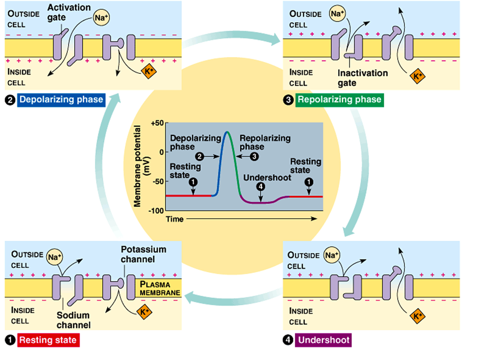
**在神经细胞上电信号的传导**
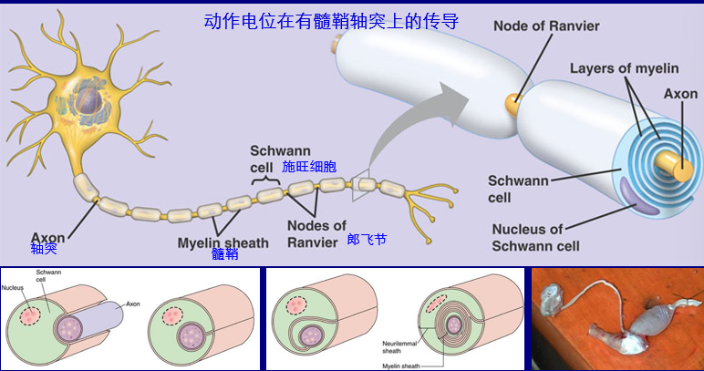

有髓鞘神经纤维外面包有1层几乎不导电的髓鞘,髓鞘只在朗维埃氏结处中断，轴突膜和细胞外液直接接触，允许离子的跨膜移动,因此有髓鞘纤维在受到刺激时,动作电位仅在朗维埃氏结处发生。神经冲动传导时，局部电流也只能在朗维埃氏结处流入或流出纤维，在纤维内正电荷由兴奋的朗维埃氏结通过节间纤维流向相邻的未兴奋的朗维埃氏结，而在胞外液体中，正电荷由未兴奋的朗维埃氏结沿着节间纤维流向兴奋的朗维埃氏结。这个电流方向使未兴奋朗维埃氏结膜去极化，和无髓鞘纤维一样，当这个电流足够大时，就引起未兴奋的朗维埃氏结产生动作电位。由于神经冲动仅在相邻的朗维埃氏结上先后产生，所以有髓鞘纤维的神经冲动的传导是跳跃式的，叫做跳跃传导，在其他条件类似的情况下，有髓鞘纤维的传导速度显然比无髓鞘纤维快，几个微米粗细的青蛙有髓鞘神经纤维的传导速度，相当枪乌鲗直径将近 1毫米的无髓鞘纤维的传导速度。神经髓鞘的出现加快了神经传导速度、节约了能量，是生物体以同样的体积与材料来处理大大增长的信息量的一种适应。
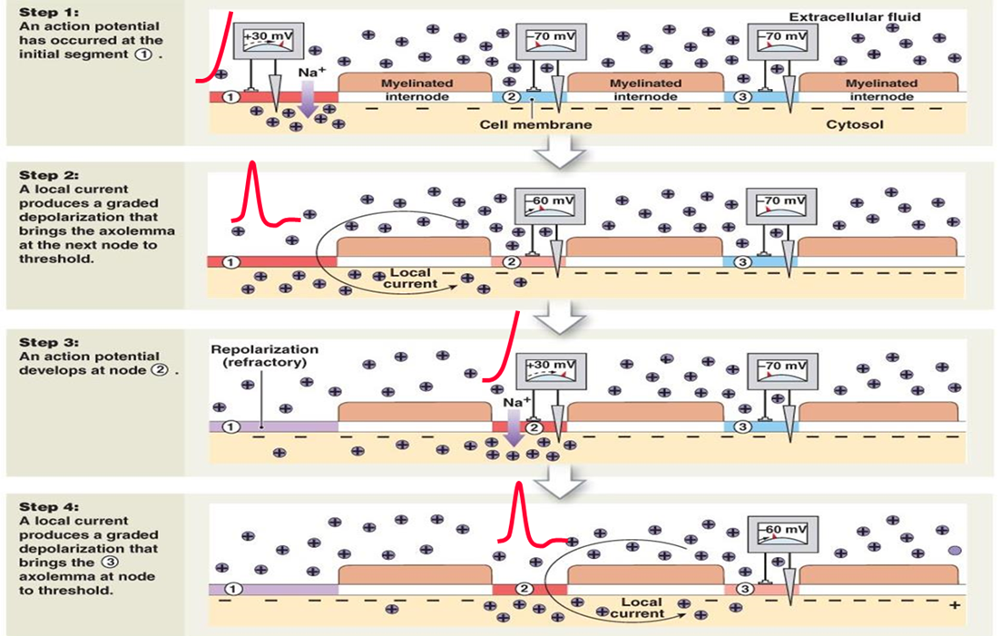
