### 碳 Carbon
**碳是组成细胞中各种大分子的基础**, 因为碳的最外层有四个电子, 可以和别的物质形成四个化学键. 除了一氧化碳, 二氧化碳, 碳酸根之类的少数简单化合物, 含碳化合物统称为有机化合物. 其数量众多, 大致可以分为几类:
	- 碳氢化合物(烃): 包含烷, 烯, 炔 等
	- 烃的衍生物
		- -OH 羟基, 含有羟基的化合物为醇
		- -CO 羰基, -CHO称为醛类, -CO在碳链中间称为酮类
		- -COOH 羧基, 含有羧基的称为羧酸
		- -NH2 氨基, 含有氨基的称为胺
		这些物质都有极性, 所以有很好的水溶性.

**细胞利用少数种类的小分子合成许多种生物大分子.** 生物大分子分为: 蛋白质, 核酸, 多糖, 脂类. 前三种大分子都是多聚体, 是由一些小分子单体组成的. 大分子的种类繁多, 但组成大分子的小分子数量很少, 而且在不同物种里都是统一的. 细胞用脱水合成 将单体合成为 多聚体, 而把多聚体水解成单体.

### 糖类
糖类的化学通式是$CH_2O$,又被称作碳水化合物. 
根据水解情况, 糖类可以分为三类: 单糖, 寡糖和多糖. 

##### 单糖
根据分子中所含的基团种类, 单糖又可以分为醛糖和酮糖.
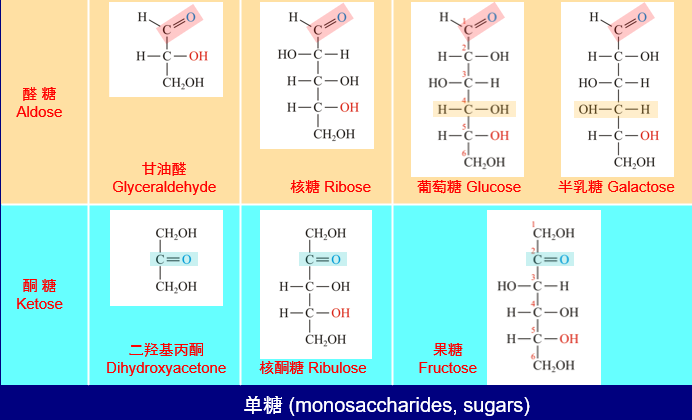
果糖要比葡萄糖甜得多, 而半乳糖最不甜. 单糖有3 4 5 6 7个碳原子组成的糖, 最重要的是戊糖和己糖.
单糖具有旋光异构现象, 因为其中有一个碳原子是不对称的, 所以两个极相似的分子实际上不是同一个分子.自然界的单糖大部分是D型, 很少是L型, L型虽然甜, 但不能为生物体利用.
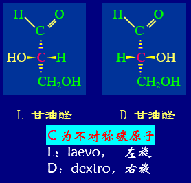
结构式的糖是线状的, 但现实中的糖其实具有环式结构. 具有两种异构体.
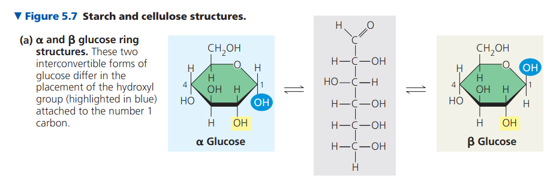

##### 寡糖
细胞中用作燃料的主要是寡糖, 但是它们也可以被合成为其他种类的寡糖和多糖.
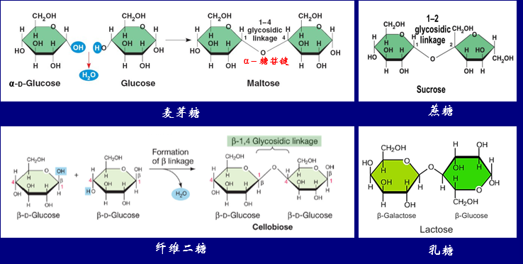
消化乳糖的酶在人长期不喝奶以后会逐渐降低, 如此以来再喝奶就会无法消化乳糖. 而肠道内细菌会利用乳糖反应, 所以会导致人体出现乳糖不耐受的症状.

##### 多糖
常见的多糖主要有淀粉(starch), 糖原(glycogen)和纤维素(cellulose)三种.
人类不能消化纤维素.
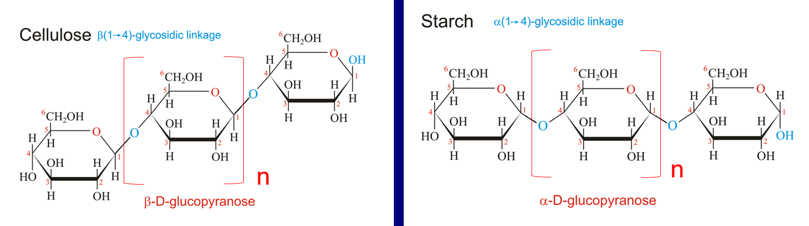
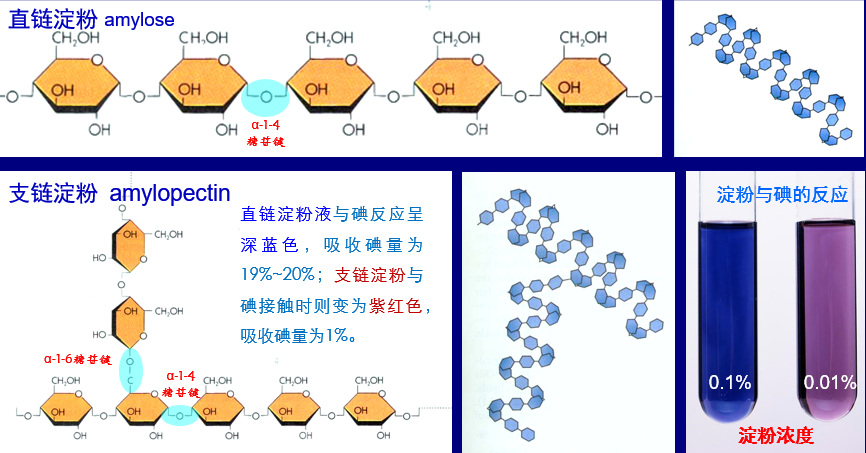
另一种常见的多糖是几丁质, 蕴藏量在地球上的天然高分子中占第二位，广泛存在于节肢动物的外壳. 几丁质的基本单位是乙酰葡萄糖胺. 用作手术缝合线的材料, 因为可以被吸收.

### 脂质 Lipid
一些低溶于水而易溶于非极性溶剂的物质；主要由C和H组成，含O比较少，因此比较适合用来储存能量（氧化）。

含酯键的脂类
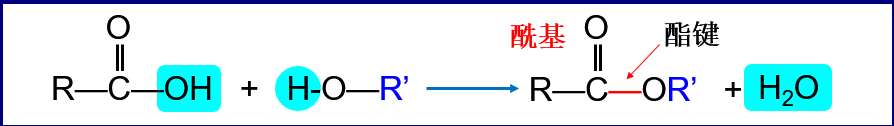

不含酯键的脂类：固醇类 萜类

#### 单纯脂——三酰甘油（甘油三酯、脂肪）
非常疏水
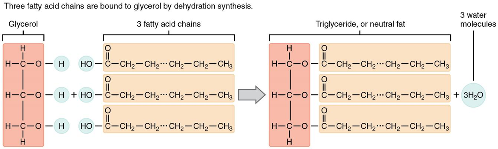

饱和脂肪酸和不饱和脂肪酸（有双键）
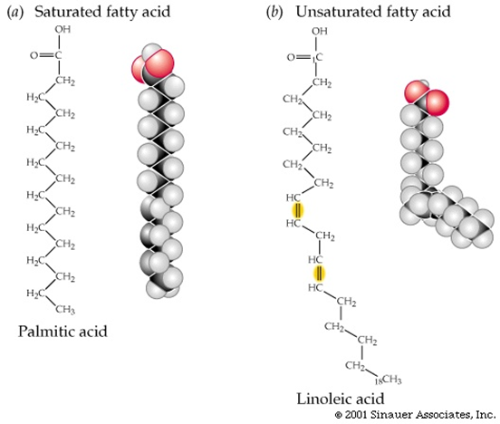
饱和脂肪酸 相互作用力更大。动物油饱和脂肪酸更多，所以熔点更高。不饱和脂肪酸含有双键，碳链弯曲，占的空间更大，排列不能太紧密，所以熔点低，常温下是液态。
都是人体需要的。
需要却无法合成：必需脂肪酸 EFA
	亚油酸 [linoleic acid, 18:2(Δ9,12)]
	亚麻酸 [α-Linolenic acid, 18:3(Δ9,12,15)]
	深海鱼油 DHA脑黄金 没有必要
自然界反式脂肪酸很少；人造黄油/奶油中反式脂肪酸较多。不饱和脂肪酸加氢，把顺式变成反式。

#### 复合脂——磷脂 phospholipid

甘油磷脂

Choline 胆碱
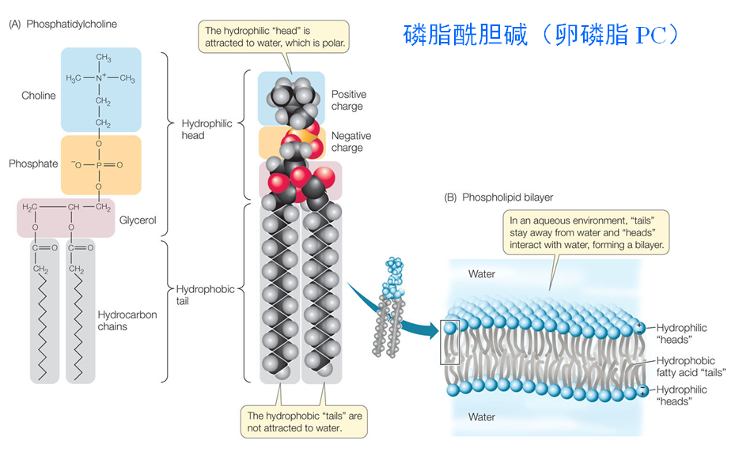
头部 尾部 磷脂双分子膜

糖脂 糖基+酯

#### 固醇类物质 steroid

胆固醇（胆甾醇），从胆结石里发现。
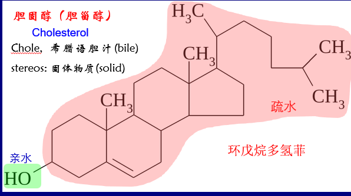
疏水太大，所以本身不能自己变成双分子膜，但是可以插到磷脂双分子层里。温度低的时候提升流动性，温度高的时候降低流动性。
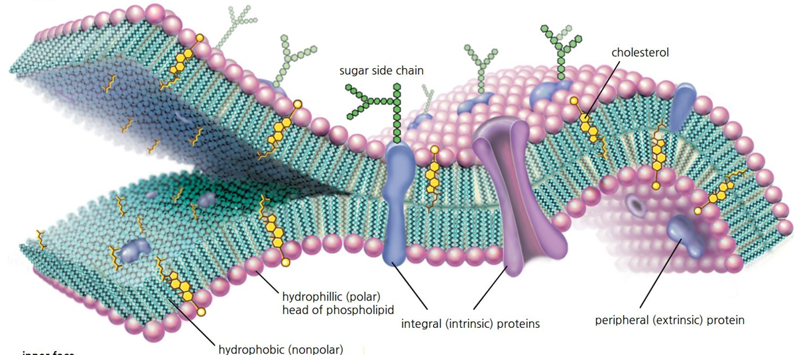
胆固醇和动脉粥样硬化。胆固醇很难吸收。靠低密度脂蛋白运输。
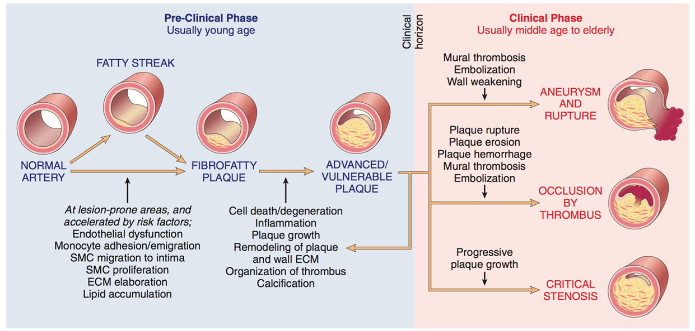

   胆固醇摄入量过多，低密度脂蛋白携带胆固醇沉积于血管壁，致使血管内皮增生，血管腔变窄，造成动脉粥样硬化。粥样斑块的继发性改变
(1)斑块内出由于斑块底部和边缘血管破裂所致。可使斑块突迅速增大，导致管腔急性阻塞。
(2)溃疡形成斑块内的粥样物质向内膜表面破溃，形成粗糙不平的溃疡。
(3)血栓形成由于内膜粗糙不平所致。可加重管腔的狭窄并引起动脉管腔的阻塞。
(4)动脉瘤形成由于病变部位平滑肌萎缩变薄，在血压的作用下，局部扩张膨出形成。
(5)钙化斑块内发生钙盐沉积。使动脉壁弹性降低，脆性增加。
植物细胞不含胆固醇，但含有其他类型的固醇，可达膜脂的50%。
高密度脂蛋白运载周围组织中的胆固醇，再转化为胆汁酸或直接通过胆汁从肠道排出

重要的固醇类物质：维生素D 睾酮 孕酮 皮质醇 雌二醇
皮质醇是糖皮质激素的一种，此激素可提高肝的糖原和血糖值，促进从蛋白质合成糖，抗炎症和过敏反应。
雌二醇主要的功能是促进雌性性器官的发育，使子宫、乳腺发育，产生性欲。排卵前它大量分泌，使子宫内膜加厚。排卵后生成的黄体分泌黄体酮，使受精卵着床。卵若没有受精，黄体萎缩，子宫内膜增厚部分脱落，形成月经，若受精，孕酮继续分泌，是安胎所必需的。

促蛋白合成类固醇 运动员服用，促进肌肉形成，但有**严重副作用**

#### 萜类

维生素A 夜盲症
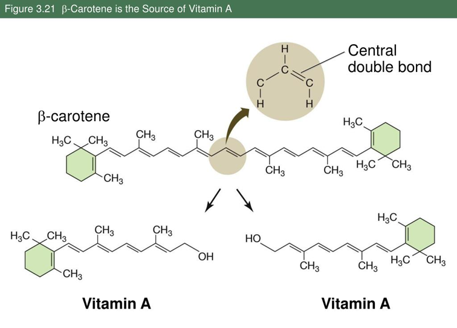
**视觉的产生**：
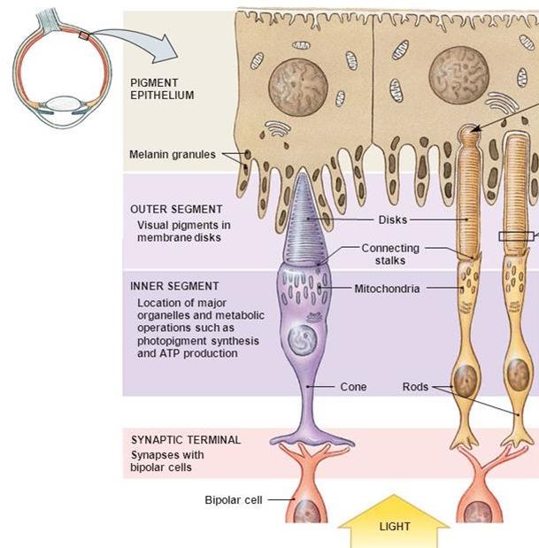
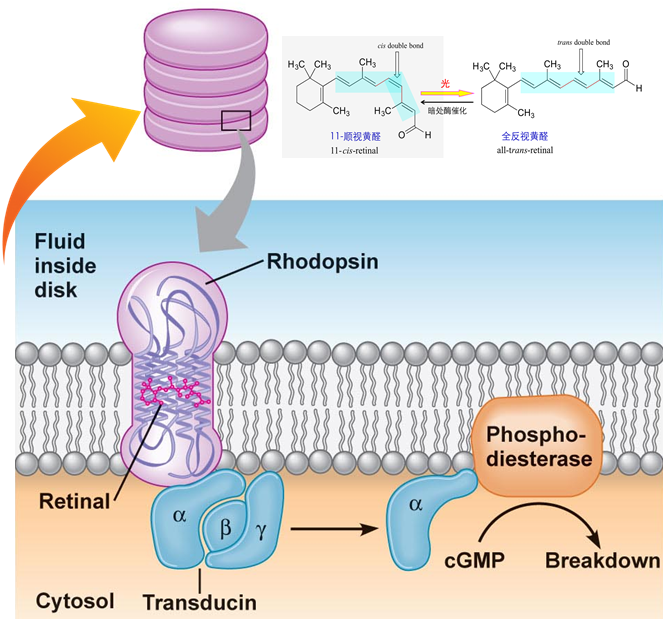
   人视网膜有视杆细胞约12000万个，对弱光刺激敏感；视锥细胞有650万～700万个，对强光和颜色敏感。二种细胞平行排列，视锥细胞主要集中在中央凹；视杆细胞由中央凹边缘向外周渐多。
视网膜脱离是视网膜的神经上皮层与色素上皮层的分离。两层之间有一潜在间隙，分离后间隙内所潴留的液体称为视网膜下液。脱离部分的视网膜无法感知光刺激，导致眼部来的图像不完整或全部缺失。

视紫红质在光照时迅速分解为视蛋白和视黄醛。视黄醛分子在光照时发生了分子构像的改变，即它在视紫红质分子中本来呈11—顺型变为全反型。视黄醛分子构像的这种改变，将导致视蛋白分子构象也发生改变，经过较复杂的信号传递系统的活动，诱发视杆细胞出现感受器电位。  
在亮处分解的视紫红质，在暗处又可重新合成，亦即它是一个可逆反应，起反应的平衡点决定于光照的强度。视紫红质再合成的第一步，是全反型的视黄醛变为11—顺型的视黄醛，很快再同视蛋白结合形成视紫红质。贮存在视网膜的色素细胞层中的维生素A也是全反型的，属于全反形视黄醇，它们也可在耗能的情况下变为11—顺型的，进入视杆细胞，然后再氧化为11—顺型的视黄醛，参与视紫红质的合成和补充。在视紫红质分解和再合成的过程中，有一部分视黄醛被消耗，这最终要靠食物进入血液循环中的维生素A来补充。长期摄入维生素A不足，将会影响人在弱光下的视力，引起夜盲症。

**色觉的产生**
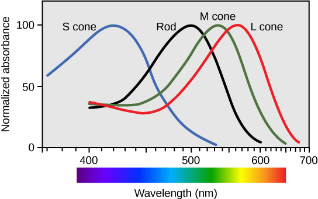

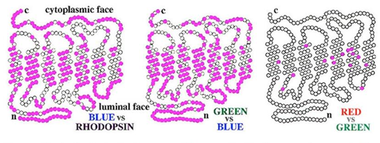

 在视觉细胞内由 11-顺视黄醛（retinal）与不同的视蛋白（opsin）组成视色素。在感受强光的锥状细胞内有视红质、视青质及视蓝质，杆状细胞内有感受弱光或暗光的视紫红质。当视紫红质感光时，视色素中的11一顺视黄醛在发生的光异构作用下转变成全反视黄醛，并与视蛋白分离而失色，这一光异构变化同时可引 起杆状细胞膜的 Ca2+离子通道的开放， C2+迅速流人细胞并激发神经冲动，经传导到大脑后产生视觉。视网膜内经上述过程产生视黄醛，虽少部分可经异构酶作用缓慢地重新异化成为11一顺视黄醛，但大部分被还原成全反视黄醇，经血流至肝变成11一顺视黄醇，而后再随血流返回视网膜氧化成11-顺视黄醛，合成视色素。其他视色素的感光过程与视紫红质相同（图4）。

 在维生素A缺乏时，必然引起11-顺视黄醛的补充不足，视紫红质合成减少，对弱光敏感性降低，日光适应能力减弱，严重时会发生“夜盲症”。

视锥细胞外段也具有与视杆细胞类似的盘状结构，并含有特殊的感光色素，但分子数目较少。大多数脊椎动物具有三种不同的视锥色素，各存在于不同的视锥细胞中。三种视锥色素都含有同样的11—顺型视黄醛，只是视蛋白的分子结构稍有不同。  
 色觉的三原色学说 视锥细胞功能的重要特点，是它具有辨别颜色的能力。颜色视觉是一种复杂的物理和心理现象。根据物理学原理，一种颜色不仅可以有一固定的波长引起，也可由两种或更多种其它波长光线的混合作用而产生。用红、绿、蓝三种色光（不是三种颜料）作适当混合，可以引起光谱上所有各种颜色的感觉。在上世纪初，科学家就提出了三原色学说。该学说设想在视网膜中存在着分别对红、绿、蓝的光线特别敏感的三种视锥细胞或相应的三种感光色素，并且设想当光谱上波长介于这三者之间的光线作用于视网膜时，这些光线可对敏感波长与之相近的两种视锥细胞或感光色素起不同程度的刺激作用，于是在中枢引起介于此二元色之间的其他颜色的感觉。  
 是否真的存在这样三类视锥细胞呢？有人用只作用于单个视锥细胞的细小的单色光束对视网膜进行测试，绘制出视锥细胞的光谱吸收曲线，发现不同动物和人的曲线都不外三种类型，分别代表了三类光谱吸收类型不同的三种视锥细胞。一类吸收峰值在420nm，一类在531nm，一类在558nm。差不多接近蓝、绿、红三色光的波长。支持了三原色学说。  
无论视杆还是视锥细胞的感光色素，均可分为以视黄醛及脱氢视黄醛为生色基团的两种感光色素。所以，视杆与视锥细胞中，感光色素在性质上的差异，主要取决于视蛋白的不同，而不决定于生色基团。

### **蛋白质**
蛋白质是最重要的生物大分子 是食物中最重要的营养成分。蛋白质是生命存在的基础，生命活动的执行者，具有多种重要功能。
蛋白质具有专一的形状，具有专一的功能。
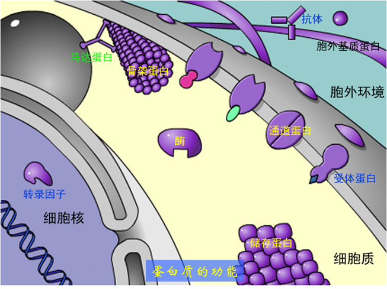

#### **基本组成单位——氨基酸**
参与形成蛋白质的有二十种，都是$\alpha$- 氨基酸。
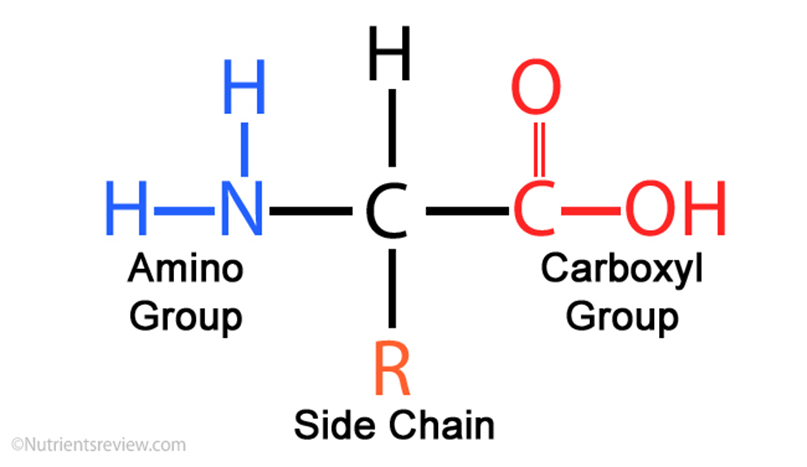
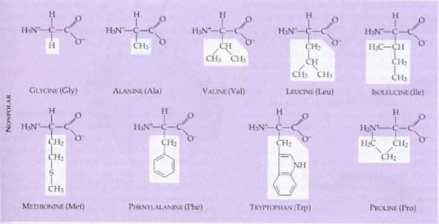

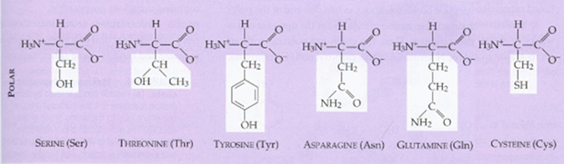
两种含硫氨基酸。甲硫氨酸 - 翻译、修饰；半胱氨酸 - 二硫键-S-S-、酶
三种含-OH氨基酸。磷酸化修饰加在羟基上。细胞增殖，癌化。

二十种天然氨基酸都是**L-氨基酸**。

#### **多肽**

肽键
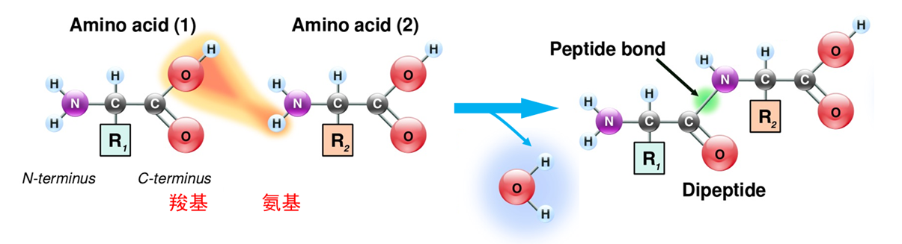
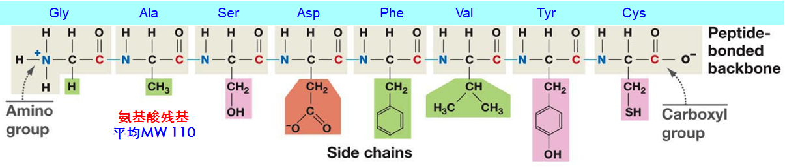
大部分多肽都是线性的，有一个方向。书写 从N末端 -> C末端。核糖体翻译蛋白质的顺序。
氨基酸残基的平均分子量：110 加权平均

**蛋白质的结构决定其功能**
**蛋白质的一级结构：组成蛋白质的氨基酸排列顺序**

#### **蛋白质二级结构**：α螺旋和β折叠

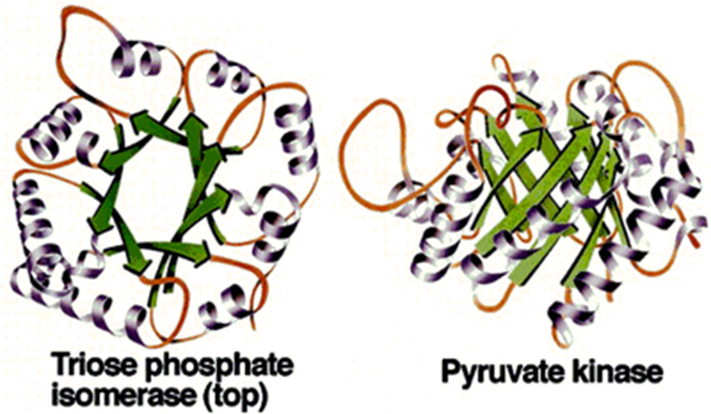
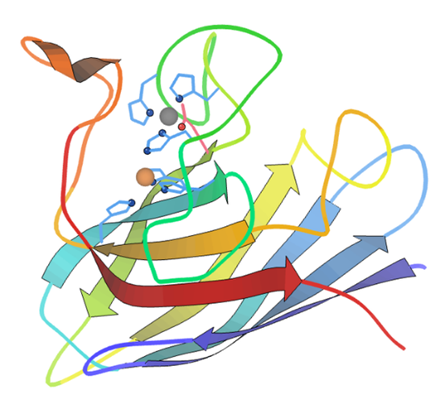
肽链主链形成α螺旋，依靠C=O中的O与它前面第4个氨基酸残基N-H的H形成氢键。
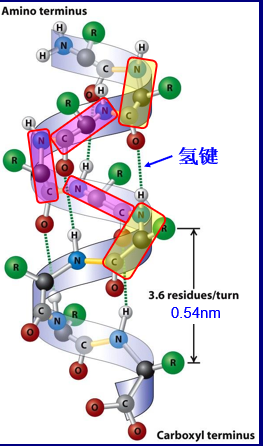
头发 —— α角蛋白

β折叠片
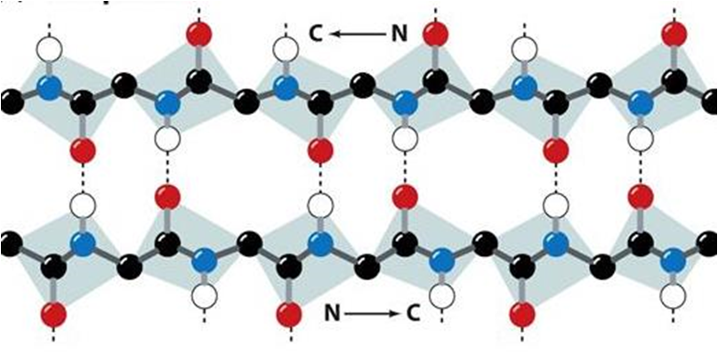
两个肽链之间的连接。蚕丝；绿色荧光蛋白；羽毛。

两种结构的相互转换：烫发
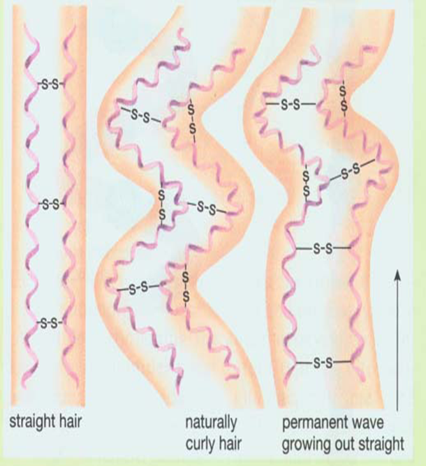

#### 蛋白质的三级结构

三级结构：单一多肽链盘绕成特定的球状空间构象，是单一肽链构成的蛋白质的最高级结构。
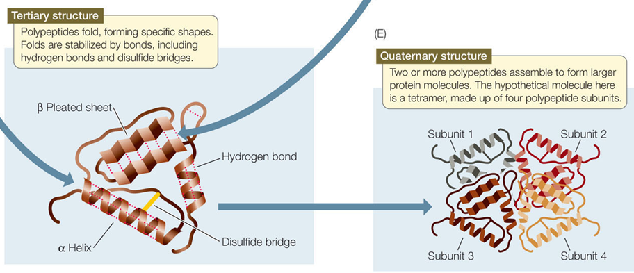
四级结构：寡聚蛋白质中各亚基之间的相互关系或结合方式。

结构域：具有特异结构和独立功能的区域，是三级结构的一部分。现已发现几十种结构域，各具功能，介导了蛋白之间以及蛋白与其它分子之间的相互作用。如DNA结合结构域能够介导蛋白与DNA分子间的相互作用。
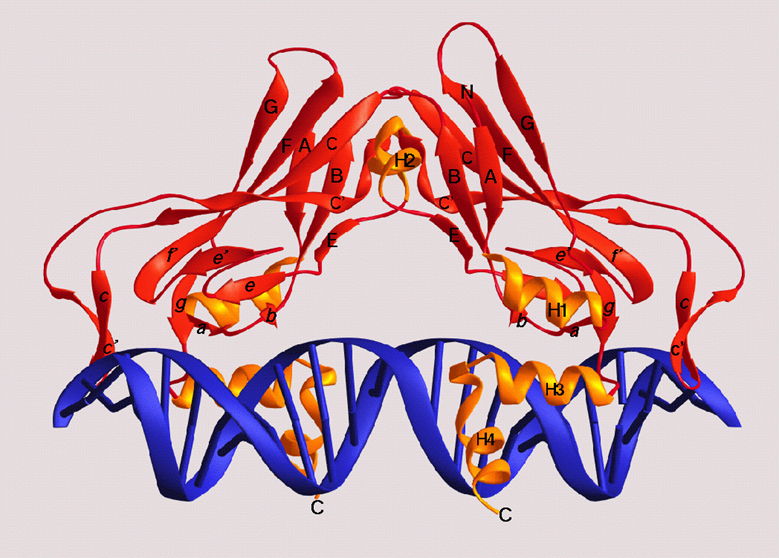
T-box转录因子3（Tbx3)二聚体的结构示意图
两个结构域：识别DNA，激活转录

维持蛋白质高级结构的作用力
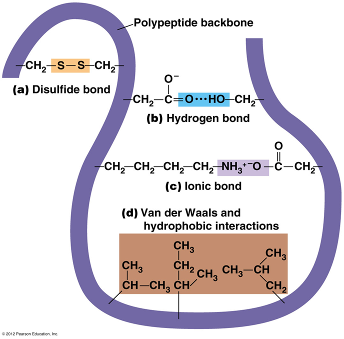

#### 蛋白质的变性和复性
变性：酸、碱、有机溶剂、去污剂、尿素或加热、紫外线等，使蛋白质空间结构破坏，生物活性丧失。
复性：变性因素去除后，变性蛋白质恢复到天然构象。
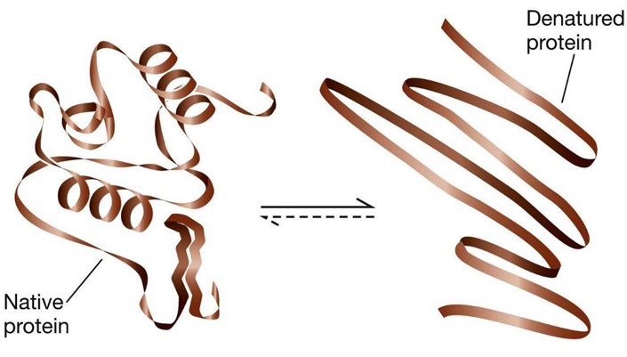
#### 蛋白质的一级结构决定高级结构
White & Anfinsen实验
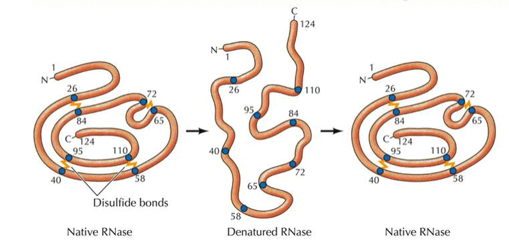
放进尿素，恢复到低级结构，再除去变性剂，恢复。所以蛋白质的一级结构决定高级结构。

**蛋白质的构象病**
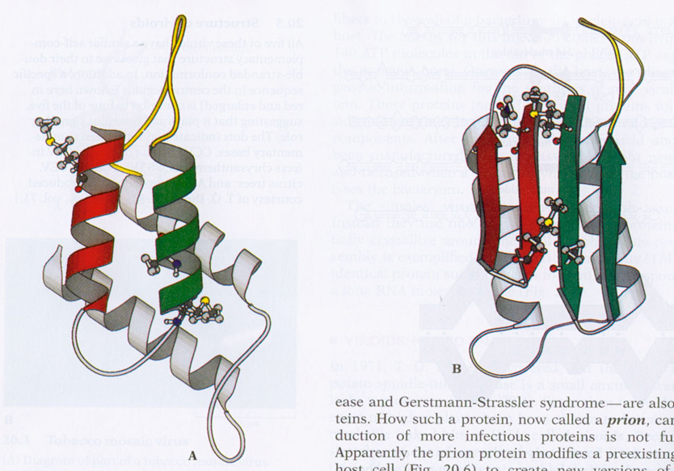
螺旋变成折叠了，于是抗酶解，聚集起来。结合正常的，都变成这样，聚集在神经元里，神经元死去。其他细胞吞进去，继续死去，脑洞大开。——疯牛病。

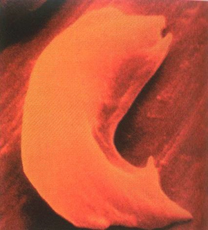
镰形红细胞贫血
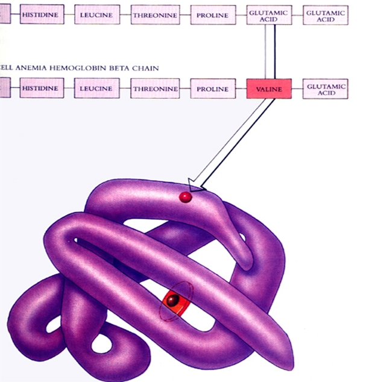
 β亚基第6位的Glu突变为Val后， β亚基三级结构发生改变，导致血红蛋白的四级结构异常，在低氧条件下彼此聚合形成纤维，使红细胞呈镰刀形，容易破碎引起贫血等病症。
 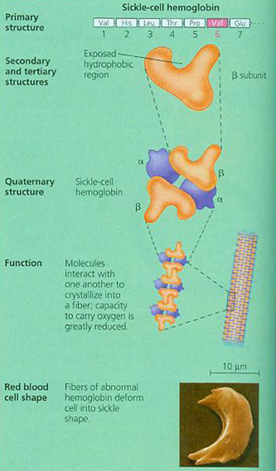

 ### 核酸 Nucleic Acid
 1868年 瑞士外科医生从伤口里发现。

 #### 基本结构单位：核苷酸
**1核苷酸 = 1（脱氧）核糖 + 1 碱基 + 1 磷酸**
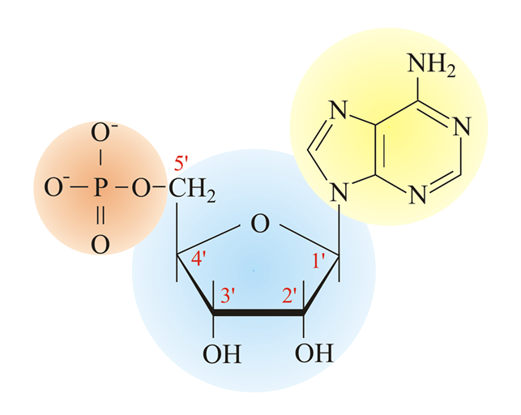
 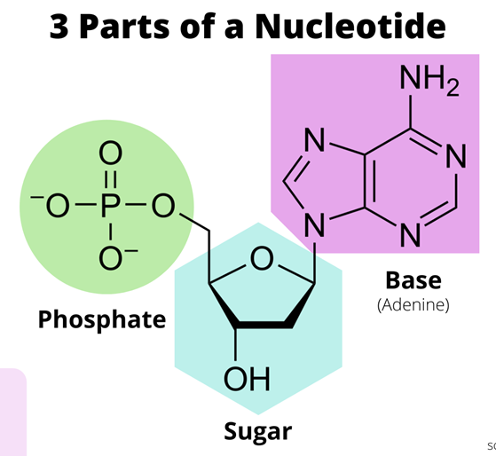
 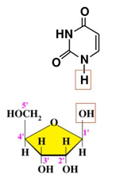 糖苷键
 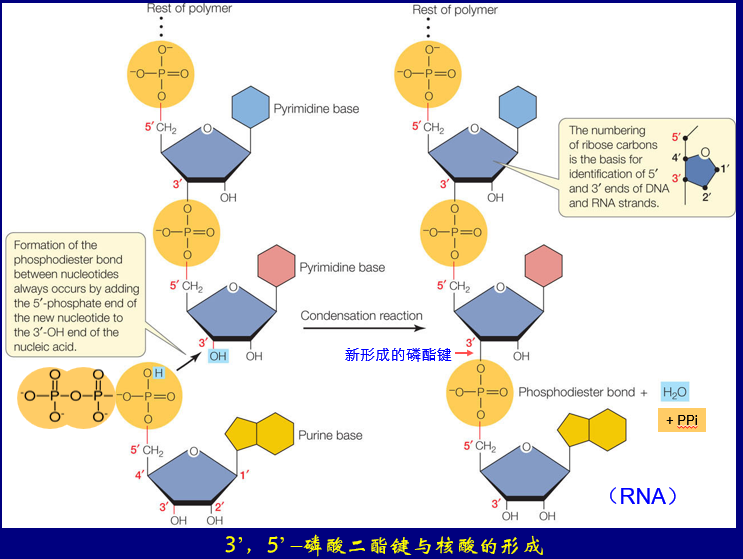
 核苷酸靠3‘，5’-磷酸二酯键连接在一起

 #### DNA的高级结构
 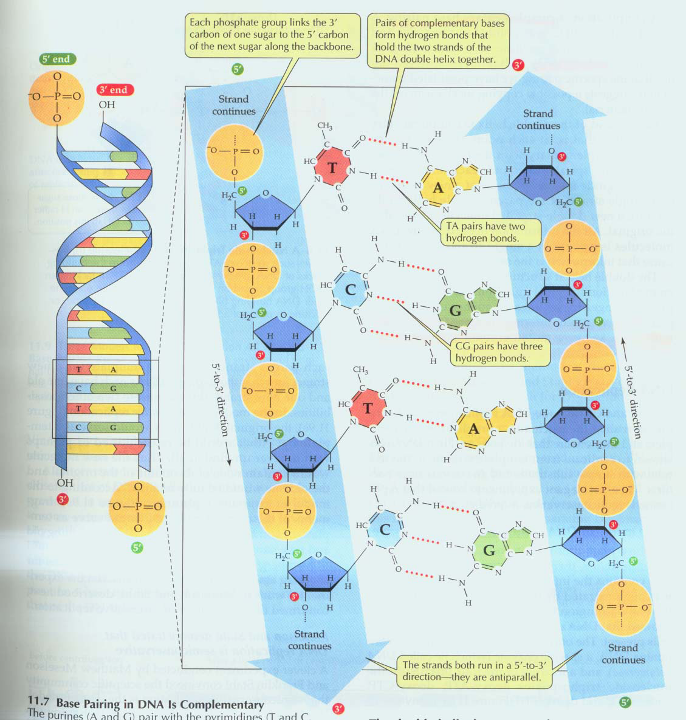
 方向：5‘写到3’
 碱基互补配对： AT 两对氢键； CG形成三对氢键

 DNA的直径：2nm；小沟和大沟
 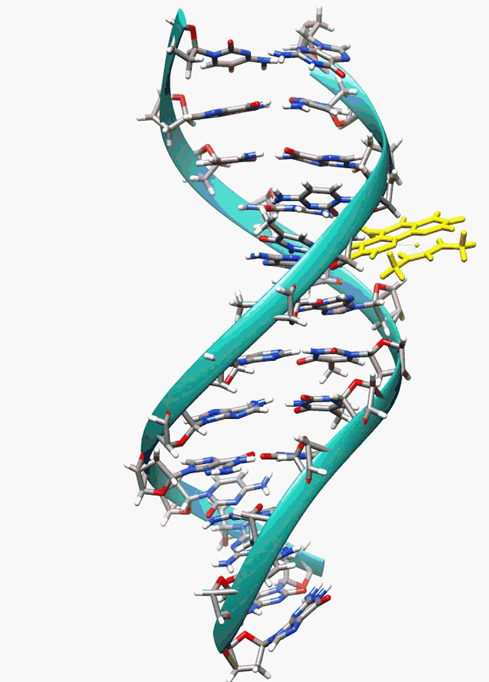
