生命活动的维持——能量代谢

**生物体主要靠有机分子的氧化取得能量**
燃烧和腐烂，都是氧化反应。腐烂，有机体由于微生物的滋生而破坏，有机物被分解为无机物，释放到自然界。反应复杂，大部分属于微生物在酶催化下的氧化反应。
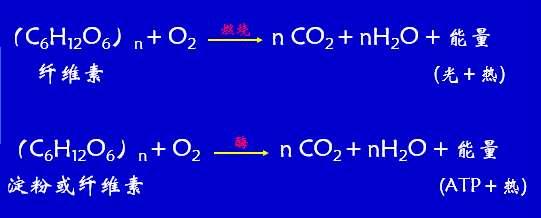
能转化为ATP的~三分之一左右

## 生命催化剂 酶Enzyme
酶是具有催化作用的生物大分子，绝大多数酶是蛋白质，有些酶含有非蛋白质成分，少数酶是RNA。
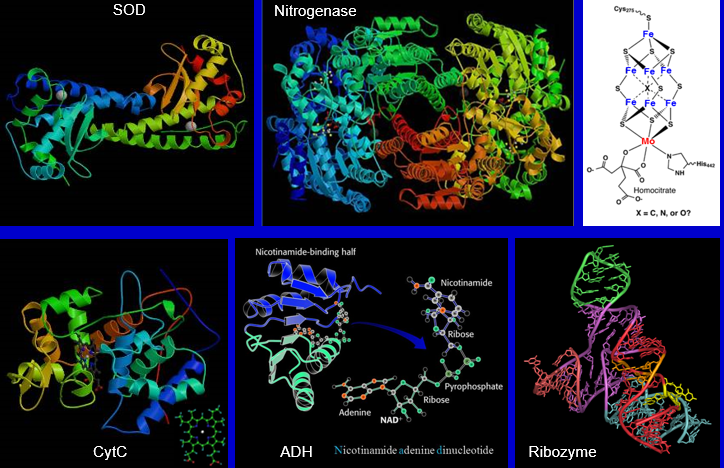
一些酶分子需要辅助因子（Cofactors）：金属离子及有机化合物才具有活性。
全酶（holoenzyme) ：酶蛋白与辅助因子的总称
辅酶（coenzyme）:与酶蛋白结合疏松的辅助因子，用透析法容易与蛋白部分分开。如辅酶I（NAD+）辅酶II（NDAP+)
辅基（prosthetic group）与酶蛋白以共价键结合的辅助因子，不能用透析法除去。如铁卟啉、黄素腺嘌呤二核苷酸（FAD）等
全酶的专一性取决于酶蛋白本身，辅助因子负责传递化学基团，电子，原子等。
[固氮](http://baike.sogou.com/lemma/ShowInnerLink.htm?lemmaId=7550135)酶是由两种蛋白质组成的：一种含有铁，叫做[铁蛋白](http://baike.sogou.com/lemma/ShowInnerLink.htm?lemmaId=7682026)，另一种含铁和钼，称为钼铁蛋白。只有钼铁蛋白和铁蛋白同时存在，固氮酶才具有固氮的作用(因为这两种物质作为电子载体能够起到传递电子的作用）
乙醇脱氢酶(Alcohol dehydrogenase,简称ADH)
核酶 ribozyme 核酸作为酶 vs 核酸酶 降解核酸的

特点：
1）催化效率高
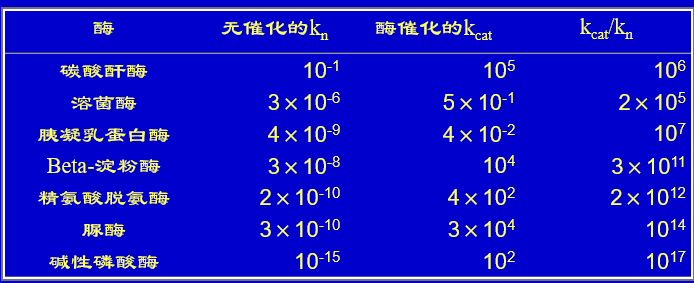
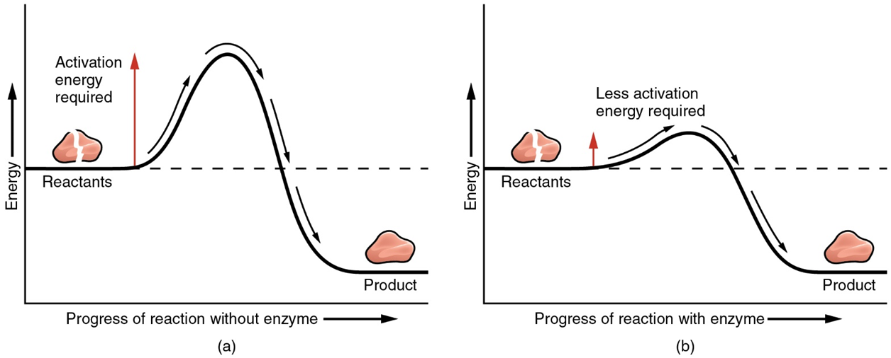

2）高度专一性
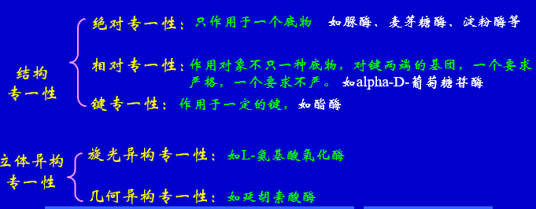
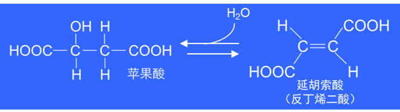
延胡索 一种中药
诱导-契合假说
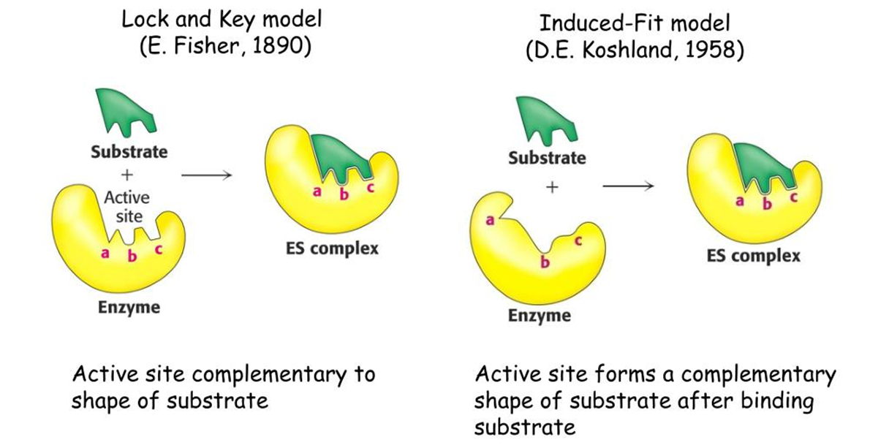
3）易失活 一般要求常温 常压 中性pH
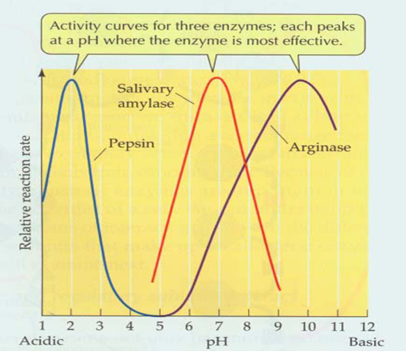

4）酶的活性易受影响 -- 抑制与激活

**不可逆抑制**：有机磷
神经性毒剂属有机磷或有机磷酸酯类化合物（organophosphorus compounds，organoposphates）。这类毒剂特别对脑、膈肌和血液中乙酰胆碱酯酶（acetylcholinesterase，AchE）活性有强烈的抑制作用，致使乙酰胆碱（acetylcholine，Ach）在体内过量蓄积，从而引起中枢和外周胆碱能神经系统功能严重紊乱。
沙林 VX Novichok等都是
一般来说是脂溶性的，所以更加危险。接触皮肤完全可以中毒。
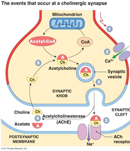

青霉素的抗菌原理
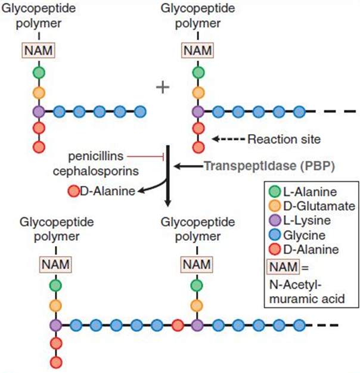
肽聚糖（peptidoglycan），又称粘质复合物（mucocomplex)、胞壁质（murein)。它是由双糖单位，四肽尾还有肽桥聚合而成的多层网状大分子结构。N-乙酰葡萄糖胺（N-Acetylglucosamine，又称NAG）和N-乙酰胞壁酸（N-Acetylmuramic Acid，又称NAMA）交替连接的杂多糖与不同组成的肽交叉连接形成的大分子。
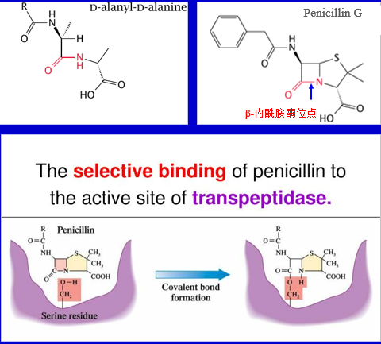
抗生素，是指由微生物（包括细菌、真菌、放线菌属）或高等动植物在生活过程中所产生的具有抗病原体或其他活性的一类次级代谢产物，能干扰其他生活细胞发育功能的化学物质。
对细菌最有力的武器。

**可逆抑制**
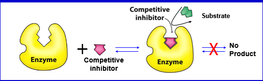
竞争性抑制 抑制底物和酶发生反应。

磺胺药
1932年G.J.P.多马克发现百浪多息能控制链球菌感染。1935年磺胺类药正式应用于临床。磺胺（即通式中R′、R″皆为H）早在 1908年就作为偶氮染料(见染料)的中间体合成出来。1932年,德国科学家K.米奇合成了红色偶氮化合物百浪多息；1932～1935年，G.多马克发现它对实验动物的某些细菌性感染有良好的治疗作用。这一划时代的发现于1935年发表以后，轰动了全世界的医药界。不久，法国科学家的研究阐明了百浪多息的抑菌作用，乃是由于它在动物体内经过代谢而生成的磺胺所致。

磺胺和对氨基苯甲酸很像，大大抑制二氢叶酸合成酶，因此抗细菌。
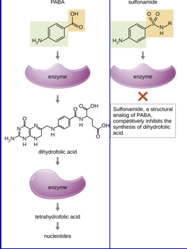

**非竞争性抑制**
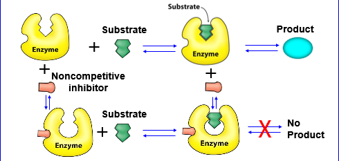
抑制剂与底物在酶上的结合位点不同，但抑制剂的结合改变酶的高级结构，使酶无法催化底物进行反应。
依靠非竞争性抑制对酶活性的调节，都依靠改变酶的构象来实现，称为别构（变构）调节  
（Allosteric Regulation ）
调节中心（别构中心）：酶分子上活性中心以外的调节部位。调节中心以非共价结合调节分子时，酶的活性发生改变。具有别构中心的酶称为别构酶（ allosteric enzyme)。
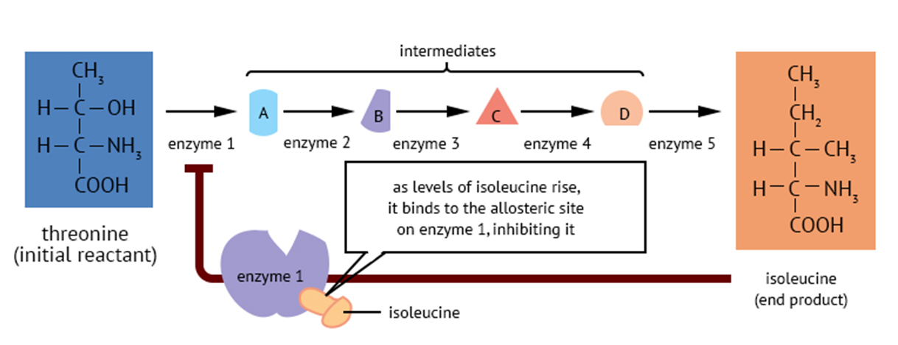
别构抑制
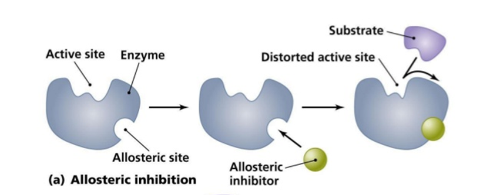
别构激活
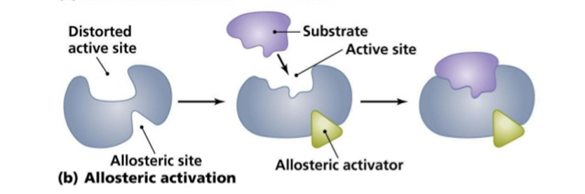
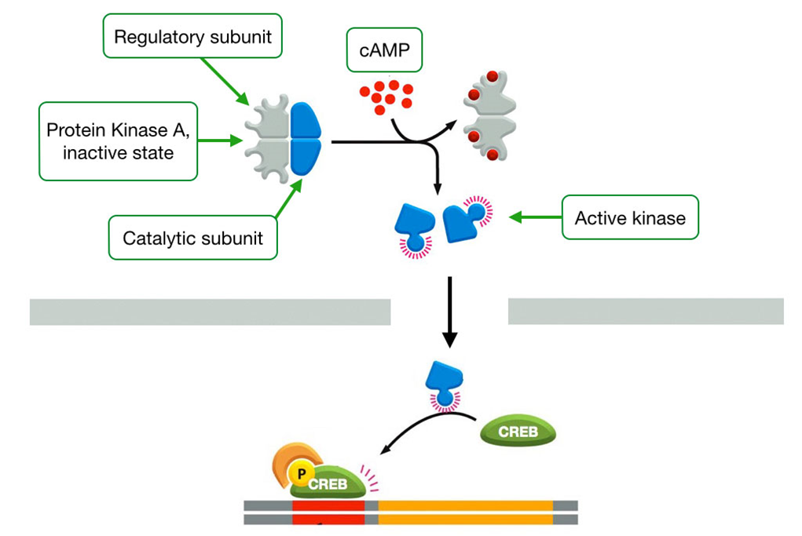
**共价修饰**
通过水解或共价连接磷酸基团，从而改变酶的构象，调节酶的活性。
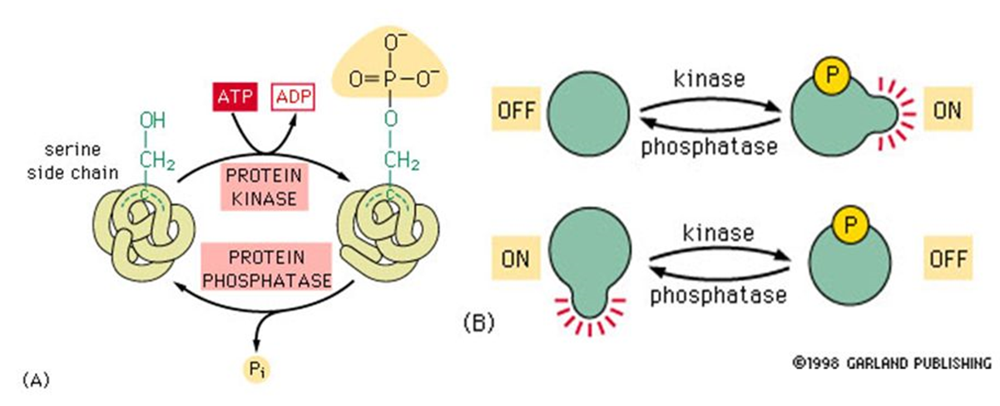
可逆的磷酸化修饰调节：在特异的磷酸酶或激酶的催化下，水解或共价连接磷酸基团，改变酶的一级结构，从而改变酶的构象，导致酶的失活或活化。

## 细胞呼吸 Cellular Respiration
有机物在细胞内经过一系列的氧化分解，生成二氧化碳、水或其他产物，释放出能量并生成ATP的过程。又称细胞氧化、生物氧化或组织呼吸。

**两种小分子**
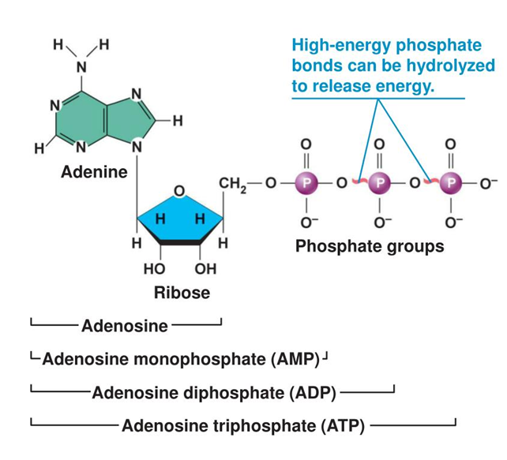
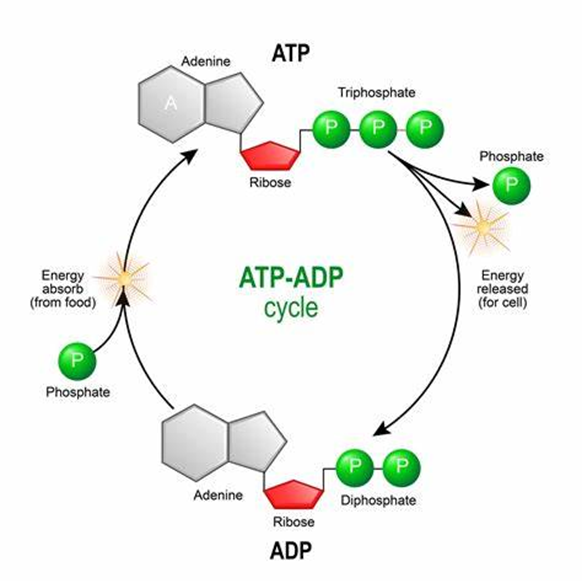

NAD+（烟酰胺腺嘌呤二核苷酸）和NADH（辅酶I）
烟酸：nicotinic acid; 即维生素B3，维生素PP (pellagra-preventive)
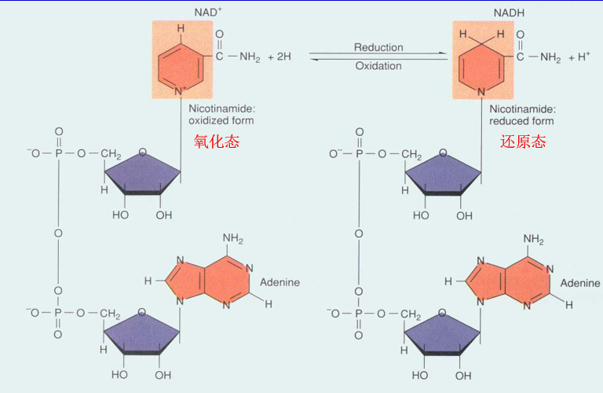
NAD＋ 从有机分子获得两个高能电子，被还原为NADH+H+；是多数脱氢酶的辅酶，称为辅酶I。

## 葡萄糖的氧化
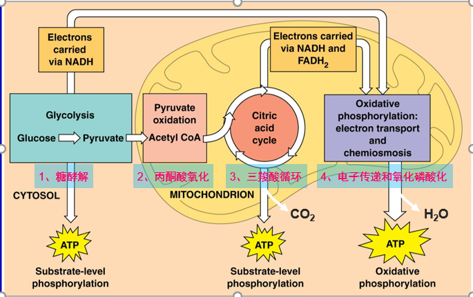

#### 糖酵解
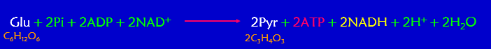
1葡萄糖->2丙酮酸~2ATP~2NADH

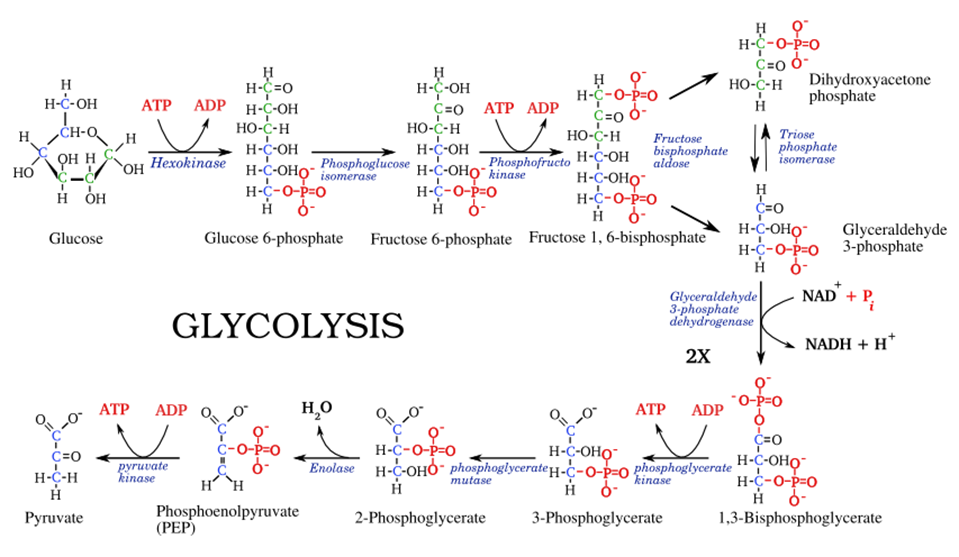

准备阶段
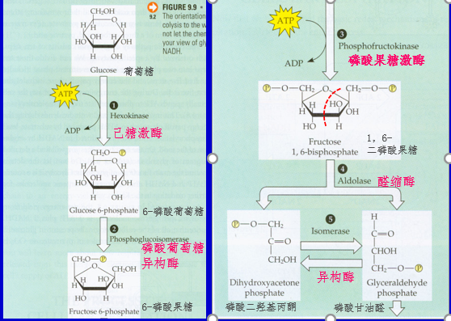
**限速步：磷酸果糖激酶-1（PFK-1）是三个限速酶中催化效率最低的，故而是糖酵解途径中最重要的调节点。** 该酶分子为四聚体。分子中不仅具有与底物结合的部位，还具有与变构激活剂和变构抑制剂结合的部位。F-1,6-BP、ADP、AMP等是其变构激活剂，而ATP、柠檬酸等为其变构抑制剂。在这些代谢物的共同调节下，机体可根据能量需求调整糖分解速度。当细胞内能量消耗增多，ATP浓度降低，AMP、ADP浓度增加，则磷酸果糖激酶-1被激活，糖分解速度加快，使ATP生成量增加；当细胞内有足够的ATP储备时，ATP浓度增加，AMP、ADP浓度下降，磷酸果糖激酶-1被抑制，糖分解速度减慢，减少ATP生成量，避免能量的浪费；当饥饿时，机体动员储存脂肪分解氧化，生成大量乙酰CoA，乙酰CoA可与草酰乙酸缩合成柠檬酸，抑制磷酸果糖激酶-1的活性，从而减少糖的分解，以维持饥饿状态下血糖浓度。低pH对该酶有抑制作用，防止无氧呼吸时乳酸过多形成，避免血液酸中毒。

为什么抑制第三个酶？为什么不抑制己糖激酶？ == 六磷酸葡萄糖有别的用途：糖原合成 磷酸戊糖

**放能阶段 
底物水平磷酸化**：   
在酶分子的作用下将底物的磷酸基团直接转移到ADP分子上产生ATP。底物高能化学键断裂释放的能量用于产生ATP。高能化合物直接将高能化学键中能量转移到ADP(GDP)生成ATP(GTP)的过程。
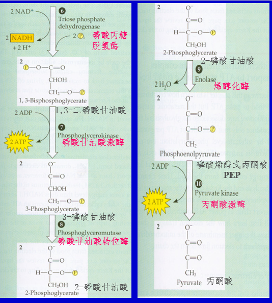

糖酵解反应如此复杂，效率如此低，何以存在？
•无需氧参与，在细胞质基质中完成，不依赖于细胞器；

•在35亿多年的漫长生命史中，无氧气的阶段占了几乎1/2；那时生物依靠糖酵解作为主要手段，获取有机物中的能量；

•现存的生物是它们的后代，无一例外具有糖酵解能力；

•有氧呼吸也建立在糖酵解的基础上。

•糖酵解的速度，与ATP的水平和NAD＋的再生有关。

糖酵解是生物界普遍存在的供能途径，但其释放的能量不多，而且在一般生理情况下，大多数组织有足够的氧以供有氧氧化之需，很少进行糖酵解，因此这一代谢途径供能意义不大，但少数组织，如视网膜、睾丸、肾髓质和红细胞等组织细胞，即使在有氧条件下，仍需从糖酵解获得能量。

 在某些情况下，糖酵解有特殊的生理意义。例如剧烈运动时，能量需求增加，糖分解加速，此时即使呼吸和循环加快以增加氧的供应量，仍不能满足体内糖完全氧化所需要的能量，这时肌肉处于相对缺氧状态，必须通过糖酵解过程，以补充所需的能量。在剧烈运动后，可见血中乳酸浓度成倍地升高，这是糖酵解加强的结果。又如人们从平原地区进入高原的初期，由于缺氧，组织细胞也往往通过增强糖酵解获得能量。

 在某些病理情况下，如严重贫血、大量失血、呼吸障碍、肿瘤组织等，组织细胞也需通过糖酵解来获取能量。倘若糖酵解过度，可因乳酸产生过多，而导致酸中毒。

**丙酮酸的去路和NAD+的再生**
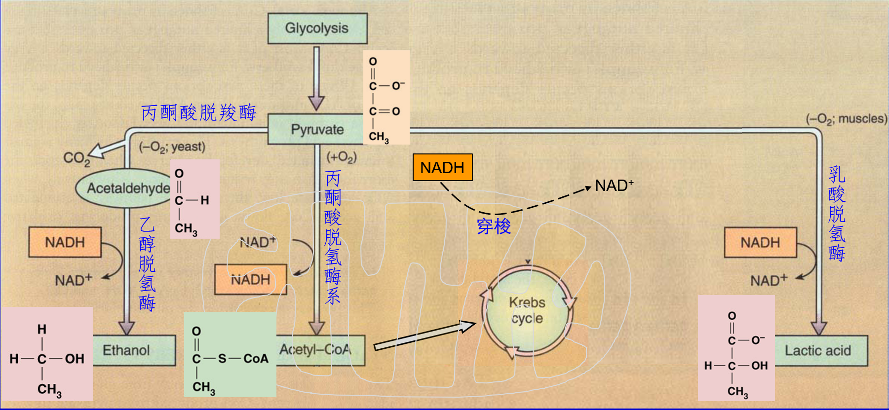
葡萄酒~12度左右 以上 酵母会被抑制

#### 三羧酸循环（柠檬酸循环）
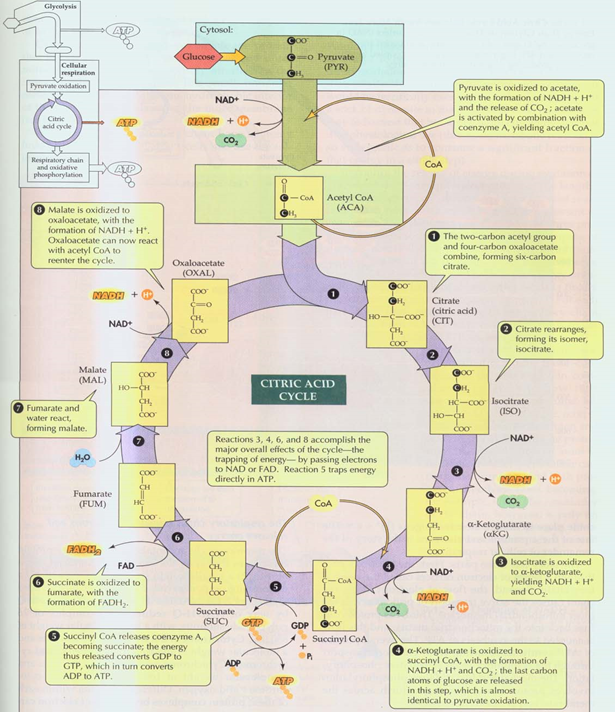
丙酮酸进入三羧酸循环的准备——形成乙酰CoA
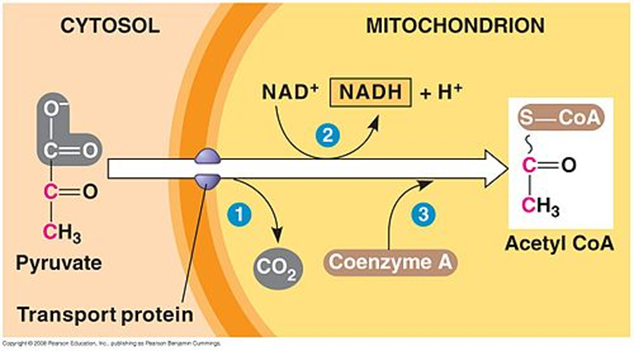
辅酶A是一种含有泛酸的辅酶，在某些酶促反应中作为酰基的载体。辅酶A是体内70多种酶反应通路的辅助因子,包括糖类的分解,脂肪酸的 氧化,氨基酸的分解,丙酮酸的降解,激发三羧酸循环,提供机体生命所需90%的能量.
辅酶A的脱氢反应：
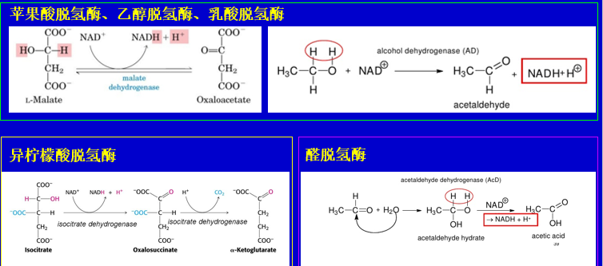

丙酮酸脱氢酶复合物( pyruvate dehydrogenase complex, PDHC) 是一种位于线粒体基质的多酶复合物。
•丙酮酸脱氢酶组分： E1,丙酮酸脱羧（辅基Vb1，TPP）
•二氢硫辛酸乙酰转移酶： E2，形成乙酰CoA （辅基硫辛酸）
•二氢硫辛酸脱氢酶： E3，脱氢，酶再生 （辅基FAD）
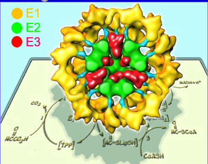
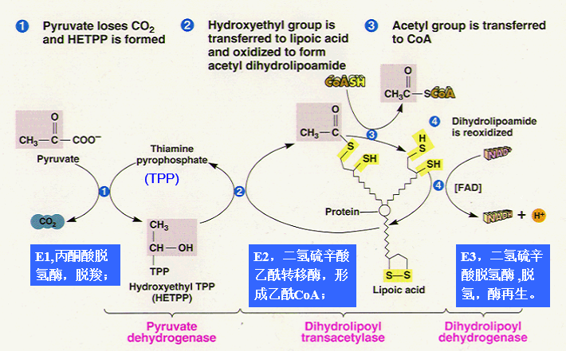

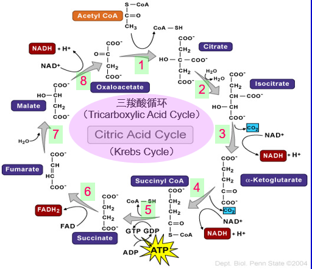
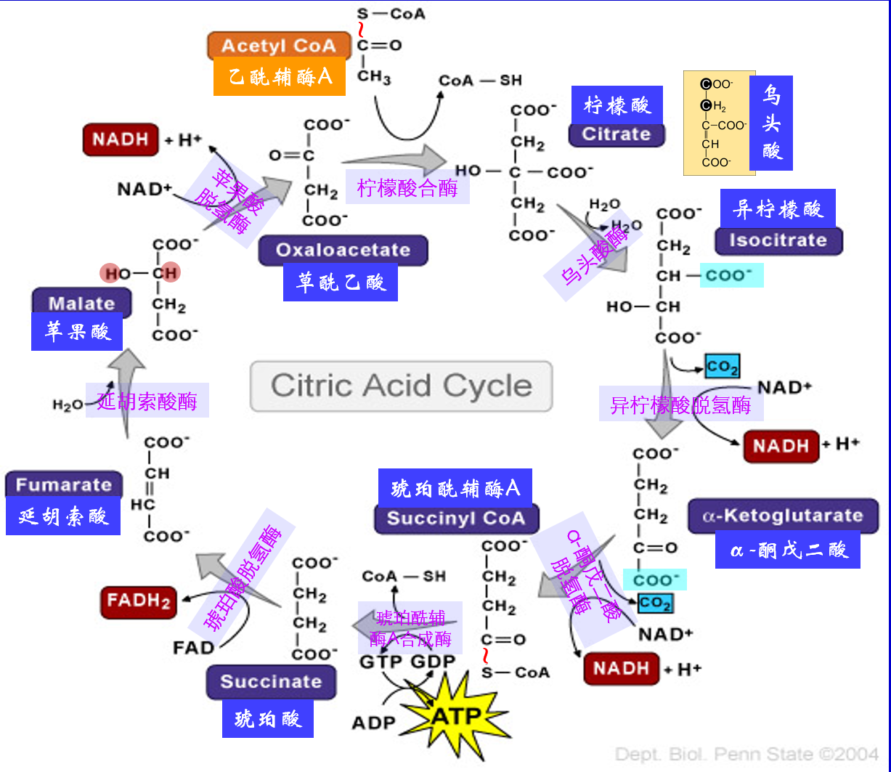
很多种水果和蔬菜，尤其是柑橘属的水果中都含有较多的柠檬酸，特别是柠檬和青柠——它们含有大量柠檬酸，在干燥之后，含量可达8%。
乌头酸首先在乌头属植物Aconitumnapellus中发现。
琥珀中含琥珀酸7．8%
延胡索酸，又名富马酸（fumaric acid）、紫堇酸或地衣酸，最早从延胡索中发现，此外也存在于多种蘑菇和新鲜牛肉中。
L－苹果酸，存在于不成熟的的山楂、苹果和葡萄果实的浆汁中。与柠檬酸相比具有酸度大(酸味比柠檬酸强20%)，但味道柔和(具有较高的缓冲指数)，具特殊香味，不损害口腔与牙齿。
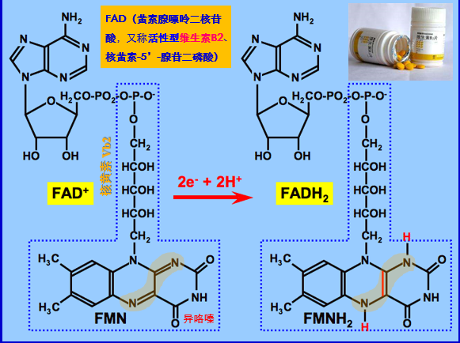
**重要的B族维生素**
B族维生素共有8种，它们在结构上没有同一性，但都通过构成辅酶参与代谢活动。
它们都是水溶性维生素，人体无法自行合成，也不会贮藏于体内，多余的B族维生素会完全排出体外，所以必须每天补充。
广泛存在于动物的肝脏、粗粮蔬菜等食物中，很多成员对光、热、氧化等敏感。
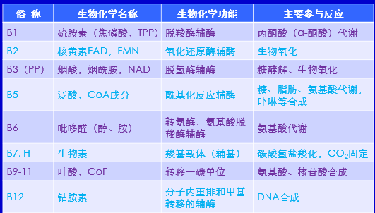
问题：   
1.C骨架被彻底氧化，H则没有；
2.为什么TCA循环需要氧
3.氧化的能量在哪里

#### **从还原型辅酶获取能量——电子传递和氧化磷酸化**
*电子传递*：
通过线粒体内膜上一系列电子载体，还原型的辅酶最终将电子传递给O2，形成H2O，本身被再氧化，称为电子传递过程。

*氧化磷酸化：*
电子沿电子传递链传递过程中，伴随着将ADP磷酸化而形成ATP的过程，又称氧化呼吸链。
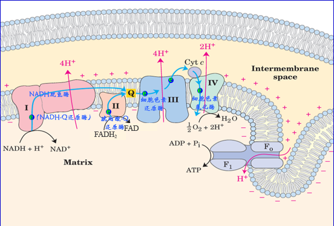
电子传递链
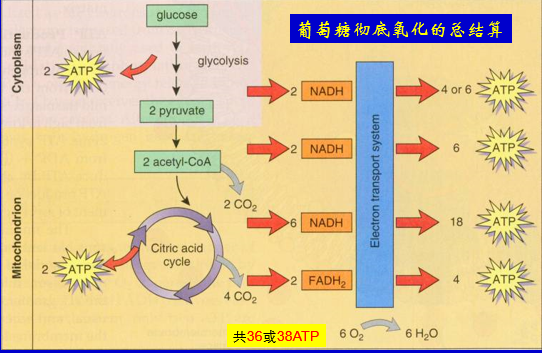

上图4~6的原因：胞质中NADH的氧化——穿梭
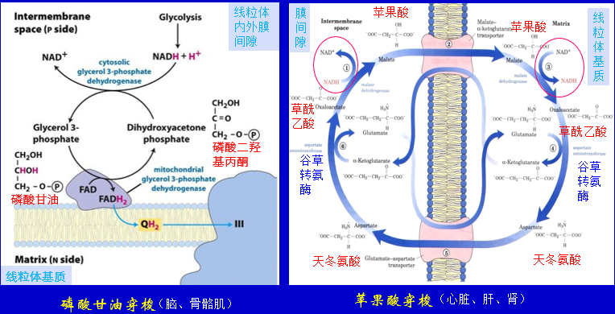

 1．苹果酸－天冬氨酸穿梭作用

 此穿梭机制比较复杂。胞液中的NADH在苹果酸脱氢酶催化下，使草酰乙酸还原为苹果酸，后者可通过线粒体内膜上的载体进入线粒体。在线粒体内的苹果酸脱氢酶作用下重新生成草酰乙酸和NADH：NADH进入NADH氧化呼吸链生成3分子ATP；而草酰乙酸经谷草转氨酶（GOT，又称天冬氨酸转氨酶，AST）作用生成天冬氨酸和α酮戊二酸，后者可借线粒体内膜上的载体进入胞液，再转变为草酰乙酸，以继续穿梭作用。此穿梭机制主要存在于肝、肾、心等器官中。故在这些组织器官中糖酵解过程中3－磷酸甘油醛脱氢产生的NADH+H+可通过此穿梭机制进入线粒体中，生成3分子ATP，即1分子葡萄糖彻底氧化生成38分子ATP。

 2．α－磷酸甘油穿梭作用

 此穿梭机制主要存在于肌肉、神经细胞中。如图所示，胞液中的NADH可使磷酸二羟丙酮还原为α－磷酸甘油，此反应在α－磷酸甘油脱氢酶催化下完成。生成的α－磷酸甘油进入线粒体，再经位于线粒体内膜近外侧部的α－磷酸甘油脱氢酶催化生成磷酸二羟丙酮和FADH2，磷酸二羟丙酮可进入胞液继续穿梭，FADH2经复合体Ⅱ（FAD呼吸链）进入呼吸链生成2分子ATP。所以经此途径1分子葡萄糖彻底氧化生成36分子ATP。

#### ATP产生机制 --- 化学渗透
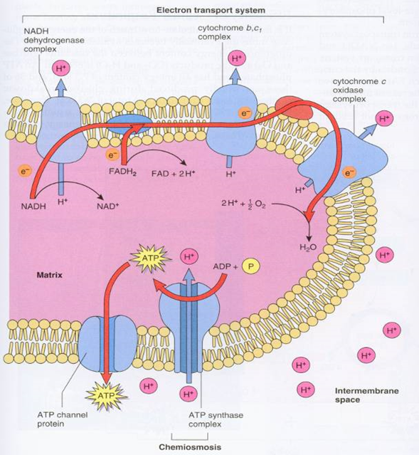
质子-ATP合酶的结构与工作原理
1. 马达
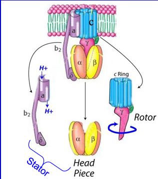
质子从a和c之间流过，c的Glu或Asp通过得失质子，结合对象不断在a和质膜间转换，从而旋转。

2. 旋转过程
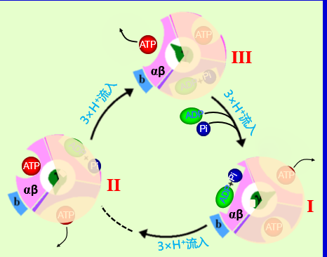
每mol葡萄糖彻底氧化实际产生的ATP为30~32mol
合成一个ATP，需要4个质子：3个用于ATP合成，一个用于ADP、Pi和ATP的转运。从NADH开始的电子传递，泵出10个质子，产生2.5个ATP；，从FADH2开始的电子传递，泵出6个质子，产生1.5个ATP。

#### 代谢整合
除了葡萄糖，其他生物分子，包括脂类、氨基酸、核苷酸等，都可以通过三羧酸循环途径，彻底氧化为 CO2 和 H2O ，同时产生能量。
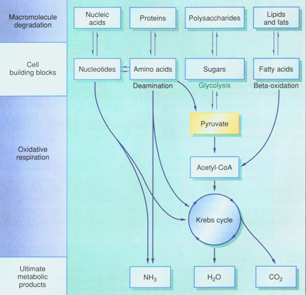

脂肪酸的β-氧化
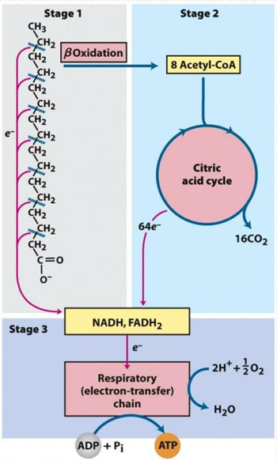
三酰甘油是高度密集的能量贮存库：

6碳的脂肪酸，经过氧化产生36ATP，比葡萄糖多20％，而其质量不到葡萄糖的2/3，所以相同质量的脂肪酸所含能量为葡萄糖的2倍以上（1g脂肪=37 KJ（8.8kcal）, 1g葡萄糖=4.1 kcal）。脂肪无水，实际储存能量是糖的6倍。
一个体重70公斤的人，其体内储存的能量：
脂肪（三酰甘油11公斤) 100,000 kcal
蛋白质（主要是骨骼肌） 25,000
糖原 600
葡萄糖 30
20~24岁基础代谢 (50Kg） 1200/天

**脂肪酸的生物合成**
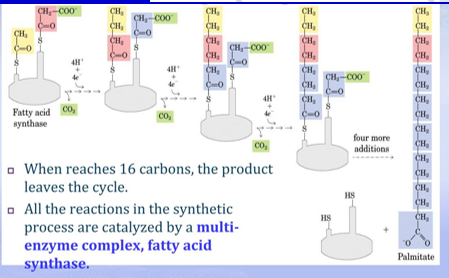

**从非糖物质合成糖 gluconeogenesis**
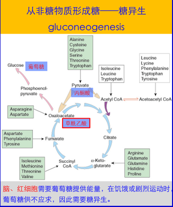

**脂肪->糖 乙醛酸循环** 植物 微生物
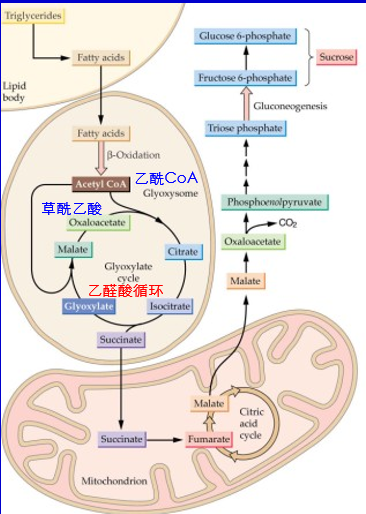

**糖代谢与氨基酸的合成**
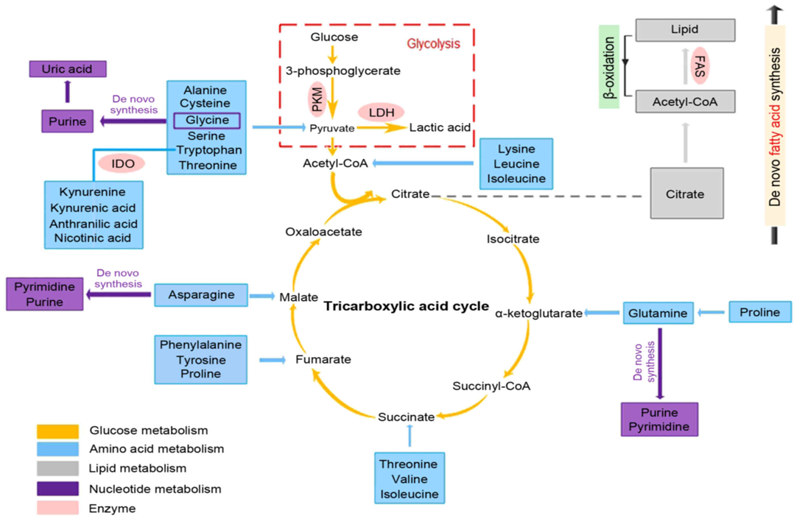

碱基的生物合成
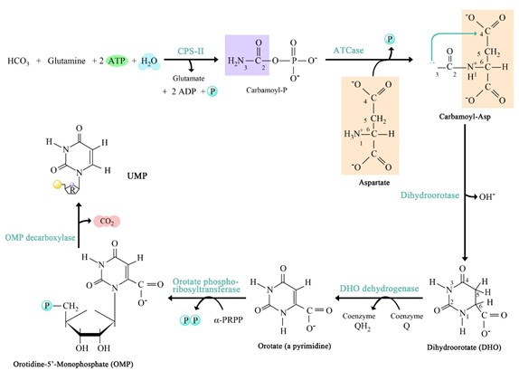
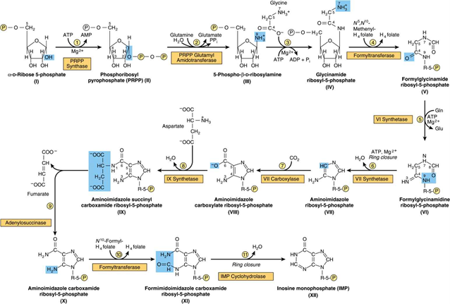

代谢通路
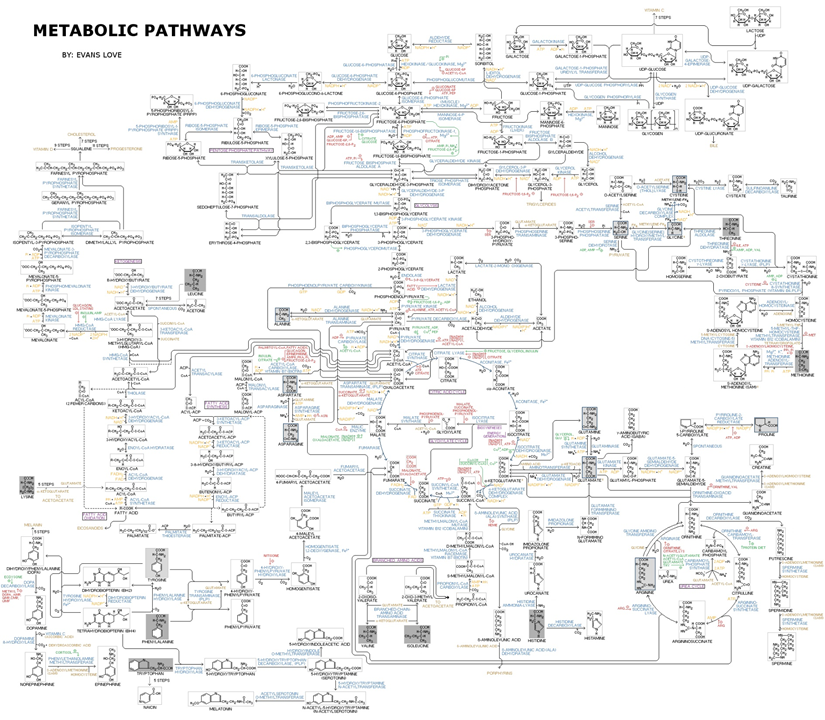

## 光合作用 Photosynthesis
葡萄糖归根结底来自光合作用。蓝细菌，光合作用可以产生氧气。改变大气的结构。
Van Helomnt实验：树养了五年，测量土和树木的质量，土没啥变化->树的养分主要并非来自土壤
Priestley实验：蜡烛燃尽氧，老鼠活不成。加了植物后，老鼠到处跑。光照行，不照不行。
总反应式
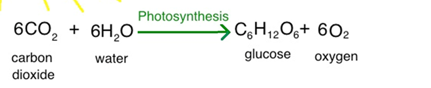
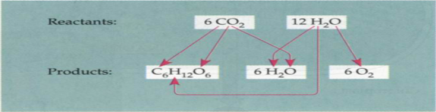
两个阶段：光反应、暗反应

场所：
光反应在类囊体膜上进行，利用光能将水氧化为O2，释放的电子通过电子传递链生成ATP和还原力。
暗反应（碳反应）在叶绿体基质中进行，不需要光；利用还原力和ATP，使CO2还原为糖。
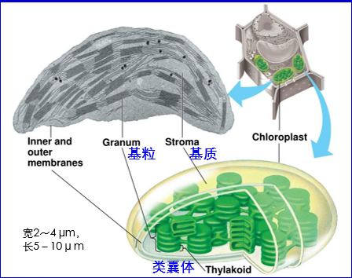
基粒类囊体
 许多类囊体象圆盘一样叠在一起，称为[基粒](http://baike.baidu.com/view/472596.htm)，组成基粒的类囊体，叫做基粒类囊体，构成[内膜系统](http://baike.baidu.com/view/434558.htm)的基粒片层（grana lamella）。基粒直径约0.25~0.8μm，由10~100个类囊体组成。每个叶绿体中约有40~60个基粒。 基质类囊体
 贯穿在两个或两个以上基粒之间的没有发生垛叠的类囊体称为基质类囊体，它们形成了内膜系统的基质片层（stroma lamella）。
 由于相邻基粒经网管状或扁平状基质类囊体相联结，全部类囊体实质上是一个相互贯通的封闭系统。类囊体做为单独一个封闭膜囊的原始概念已失去原来的意义，它所表示的仅仅是叶绿体切面的平面形态。 
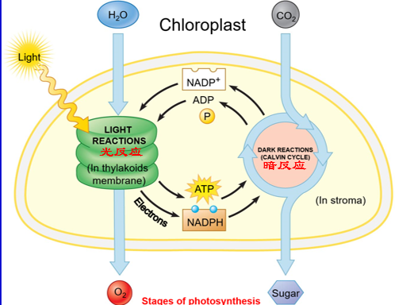
为什么植物是绿色
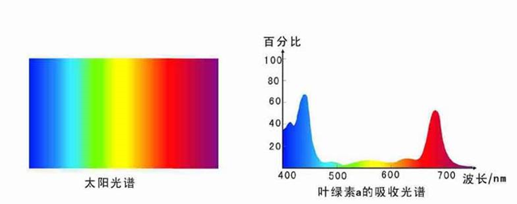
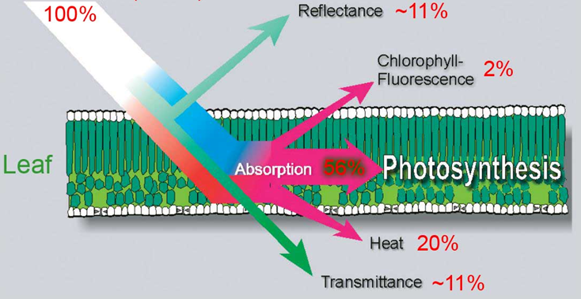
### 光反应
化学能的本质是电子势能。
分离出的叶绿素无法再进行光合作用，电子只能再跃迁回基态，能量以热和荧光（红色）形式发出。叶绿素的酒精溶液在透射光下为翠绿色，而在反射光下为棕红色。
体外提取的叶绿素分子受到光激发后，吸收的能量很快以荧光和热的形式释放，而叶肉细胞中的叶绿素被激发后，几乎观察不到荧光，而是将能量传递给中心叶绿素，激发电子。

叶绿素和蛋白质形成光复合体
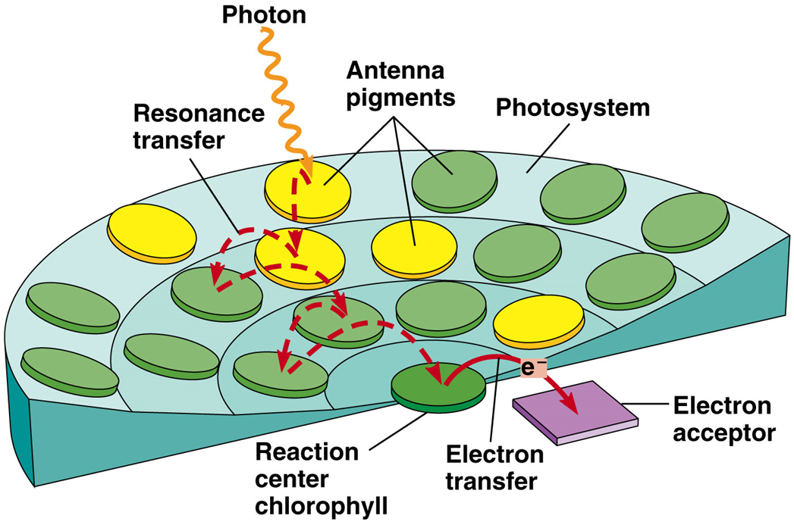
共振能量传递，每个光复合体大约包含250个叶绿素分子，组成光系统。叶绿素b比叶绿素a更难激发，激发后能量更高，可以激发叶绿素a。所以，越靠近光反应中心，叶绿素a越多，b越少。中心色素是激发能最低的叶绿素a。
捕光色素（天线色素），反应中心色素。：一类具有吸收和传递光能的作用，包括绝大多数的叶绿素a，全部的叶绿素b、胡萝卜素和叶黄素；另一类是一少部分处于特殊状态的叶绿素a。这种叶绿素a将光能转换成化学能。
每释放一个O2，需要2500个叶绿素分子，吸收8个光子，即每300个左右的叶绿素分子吸收一个光子
光系统的结构
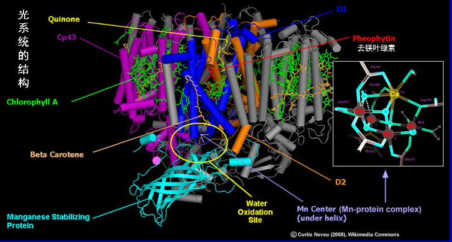

原初电子受体是去镁叶绿素。光系统I的电子从原初受体传递到Fe-S中心。光系统II则是PQ。
NADPH -- 辅酶II 做还原剂，还原二氧化碳
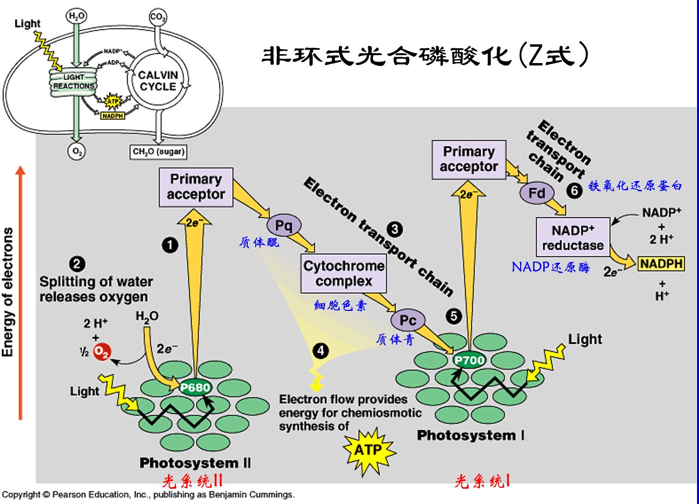
失去电子的P680从水分子中夺取电子。

光系统II的结构
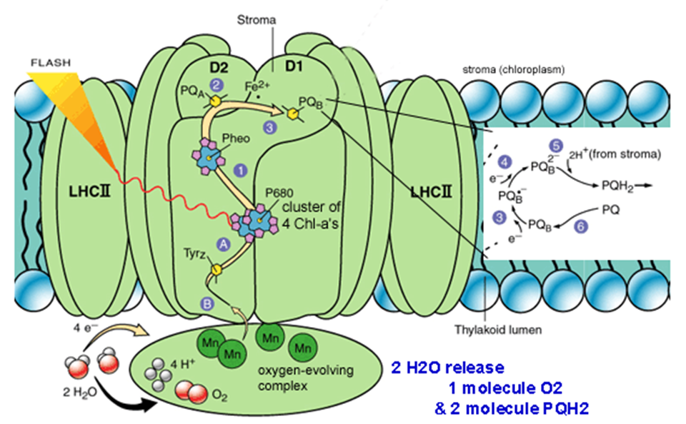

在光的照射下，第一类色素将吸收的光能传递给少数处于特殊状态的叶绿素a对（简称特殊对），即反应中心色素（P），使这些色素被激发氧化成激发态（P*），迅速交出一个电子给另外一个色素分子（即脱镁叶绿素），再传给位于类囊体外侧的非色素分子原初电子受体（A，如醌，Q）。这样就产生了一个不可逆的跨膜电荷分离，发生了氧化还原的化学变化。

**光合磷酸化**
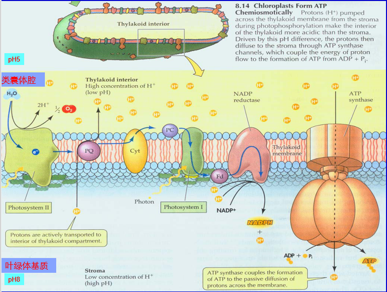
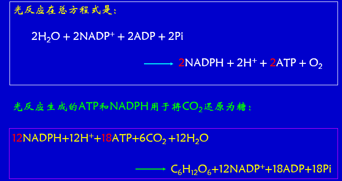
环式光合磷酸化，也能生成ATP，解决了ATP不足的问题。
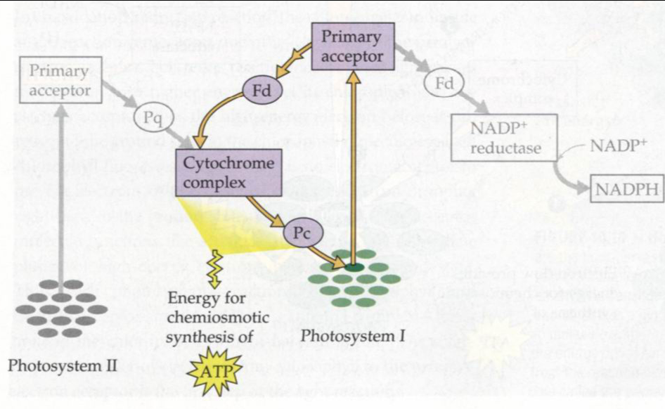
细菌基本都是环式光合磷酸化
光能自养：电子来自无机物； 光能异养：电子来自有机物

### 暗反应 -- Calvin循环
提取第一步产物 实验素材：小球藻 纸层析
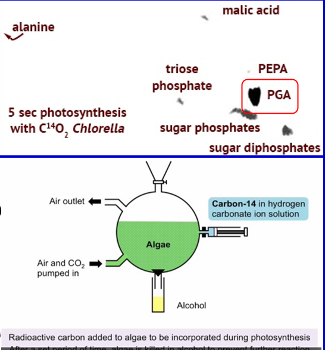

RuBP 核酮糖，接受二氧化碳 
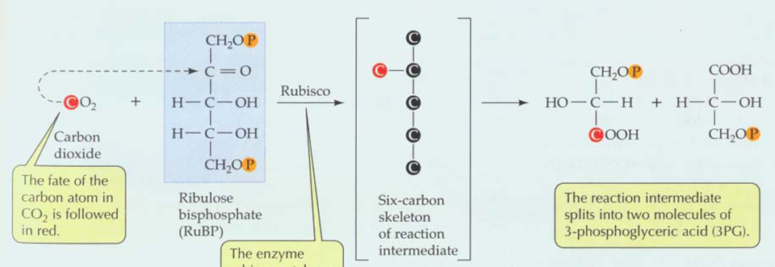
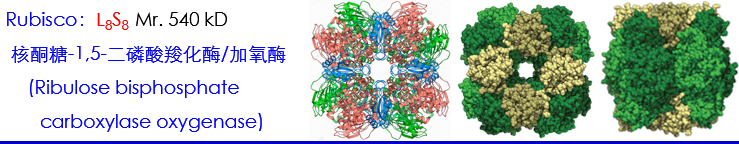

三个阶段：固定、还原、再生
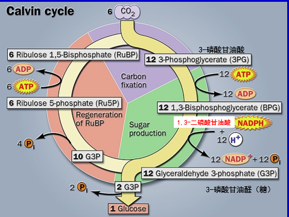

C3植物：大豆，水稻，小麦 先形成三磷酸甘油酸
C4植物：菠萝，仙人掌，玉米，甘蔗，高粱 先生成草酰乙酸，苹果酸
	用PEP来固定CO2
	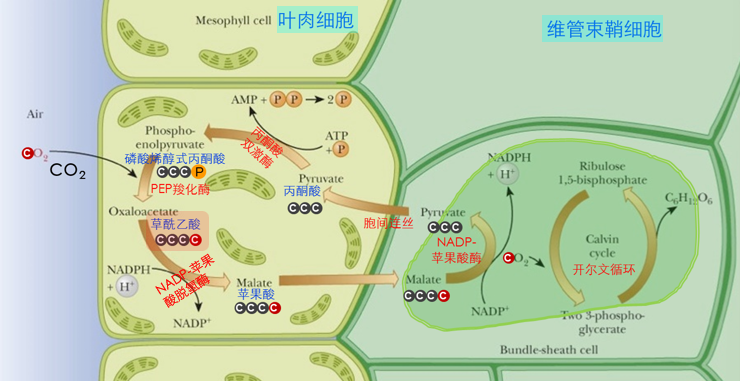
光呼吸：CO2浓度低的时候，Rubisco主要加氧。夏天植物关闭气孔，CO2进不去，光合作用不断消耗氧气，于是Rubisco开始加氧。有机物慢慢被氧化掉，不生产ATP，相当于浪费掉了。
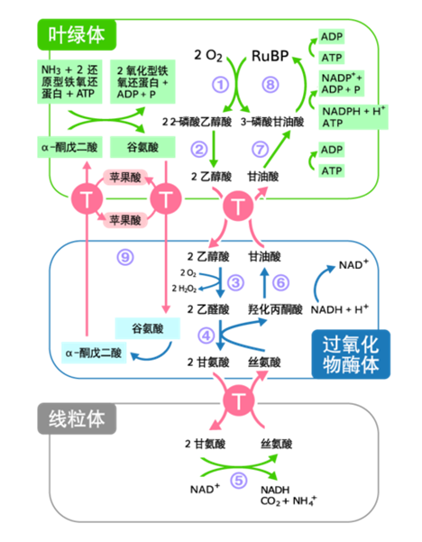
C4植物把CO2浓缩到里面的细胞，防止CO2浓度过低。
丙酮酸羧化酶不与氧气反应，能够固定低浓度CO2；
维管束鞘细胞不接触叶片中的空气；
维管束鞘细胞叶绿体几乎只有PSI，不产生O2；
还原力由NADP-苹果酸酶产生；
有一半的3-PGA运到叶肉细胞还原（玉米）。

景天 酸循环 cam植物 
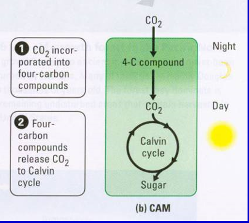
晚上固定CO2，早上开尔文循环