探究遗传的奥秘

## 泛生论 & 种质说
希波克拉底 泛生论    
•遗传有物质基础，而且是以看不见的颗粒形式（“种子”）传递的；
•身体的每个部位都提供了遗传颗粒，遗传物质来自于整个肉体；
•后天获得性能够遗传。 --- 拉马克
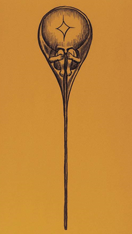

魏斯曼
实验：砍掉老鼠的尾巴，发现老鼠还是有尾巴
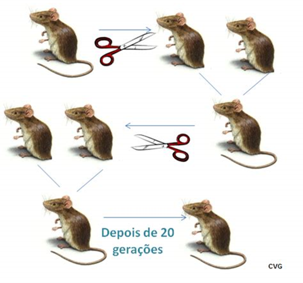
种质说：生物体由质上根本相异的两部分——种质和体质组成。认为生物体在一生中由于外界环境的影响或器官的用与不用所造成的变化只表现于体质上，而与种质无关，所以后天获得性状不能遗传。认为种质只存在于核内染色质中。魏斯曼认为染色质是由存在于细胞核中的许多遗子集合而成的遗子团。遗子中又含有许多的粒状物质，称之为定子，定子还可再分为更小的单位——生源子，后者是生命的最小单位。随着个体发育，各个定子渐次分散到适当的细胞中，最后至于一个细胞含一个定子。生源子能穿过核膜进入细胞质，使定子成为活跃状态，从而确定该细胞的分化。而种质(性细胞)则储积着该生物特有的全部定子，遗传给后代。

## 孟德尔学说
材料：豌豆 严格自花授粉，纯合；经济作物，一大堆品种
### 孟德尔第一定律——分离律
用一对性状杂交，子一代全为显性性状，子一代之间自交，子二代为：显性性状：隐性性状＝3：1
RR x rr -> Rr -> RR+Rr+rr
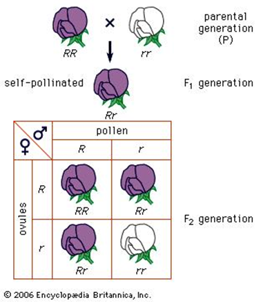

### 自由组合律
用两对性状杂交，子一代全为显性性状，子一代之间杂交，子二代出现四种性状，其数量比例为 9：3：3：1
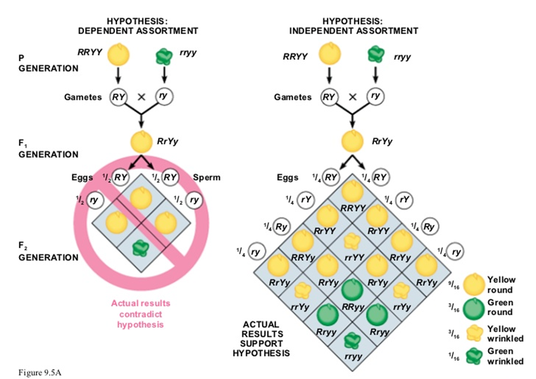

### 孟德尔的解释
- 性状由颗粒性遗传因子决定，而不是混合在一起（否则自交不出白花）
- 每对相对性状由一对等位因子决定，之间有显性、隐性的关系
- 每对因子均分到生殖细胞中，每个生殖细胞含有其中的一个
- 受精的时候，配子随机配合

现代解释
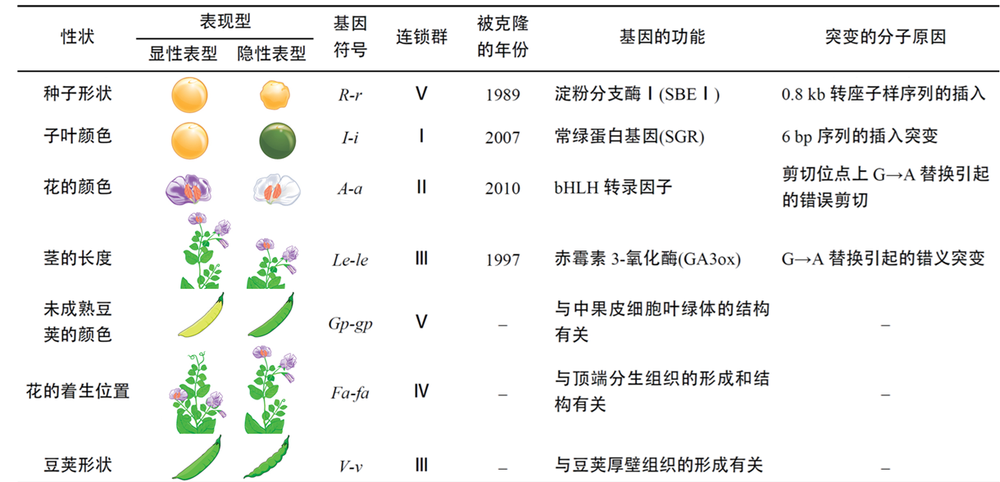
后来的模式生物（作为研究平台的生物） ~ 拟南芥 长得很快 ~ 小鼠
由单基因决定的性状按孟德尔方式遗传
改革开放很有影响的影片《追捕》《小花》陈冲

## 孟德尔理论的扩展
几个概念
表型(phenotype)：可观测的生物学特征。
显性( dominant)性状： 杂合体表现出的性状。
隐性(recessive)性状：杂合体未表现出的性状。
基因座（locus）：染色体上某基因所处的位置，也可指某特定DNA序列在染色体上所处的位置。
等位基因（allele）：存在于单一基因座上一个基因的不同形式中的一种。

**不完全显性**
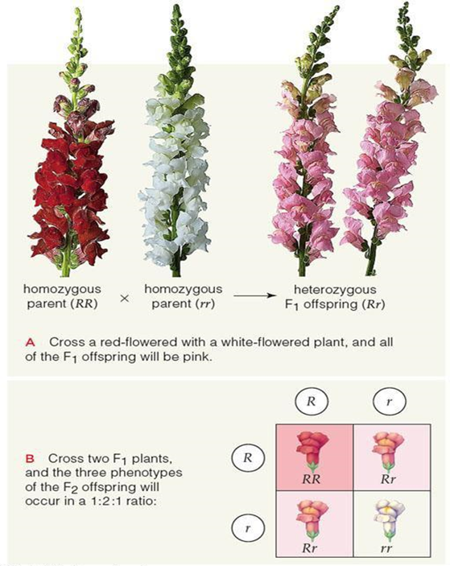

**显性隐性的分子机制**
1. 阈值型：要么没有，要么全有
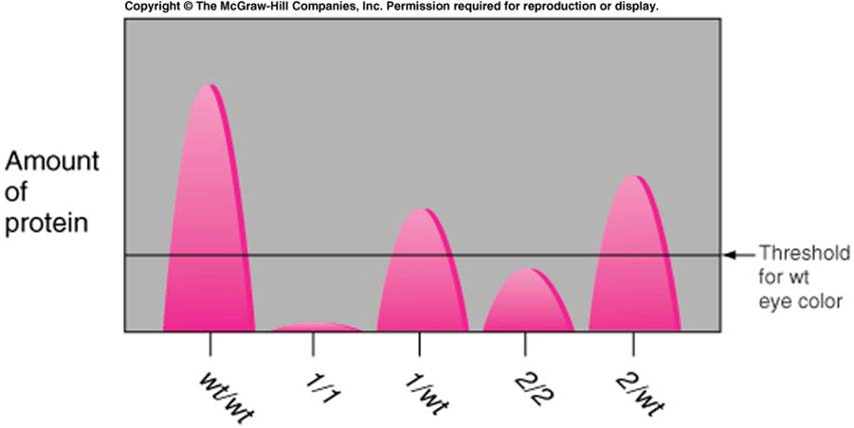
2. incomplete dominant
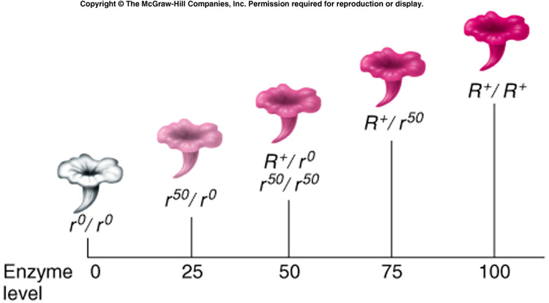

3. 共显性
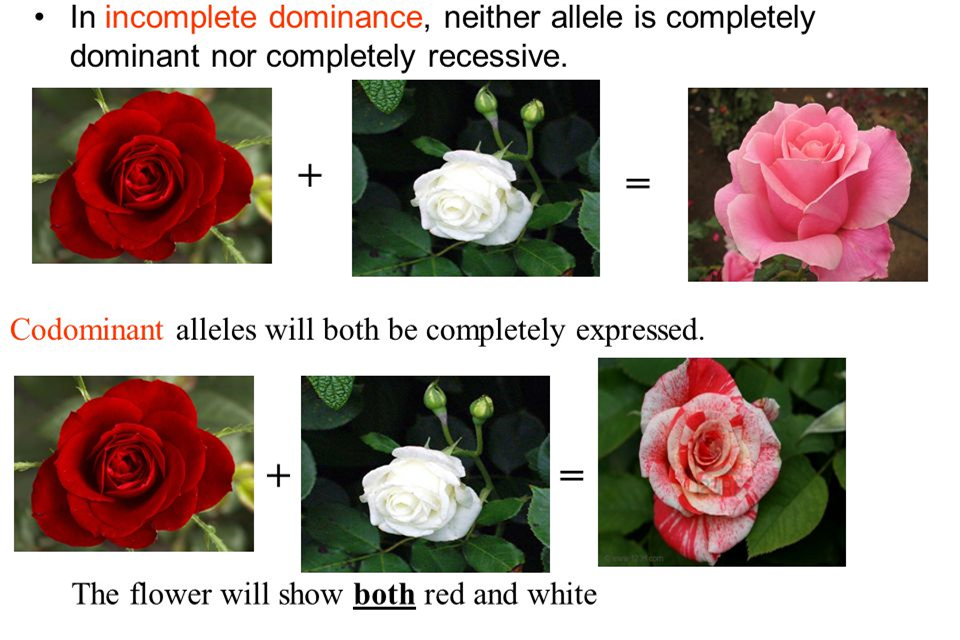
### 显性突变
1. 单倍性不足
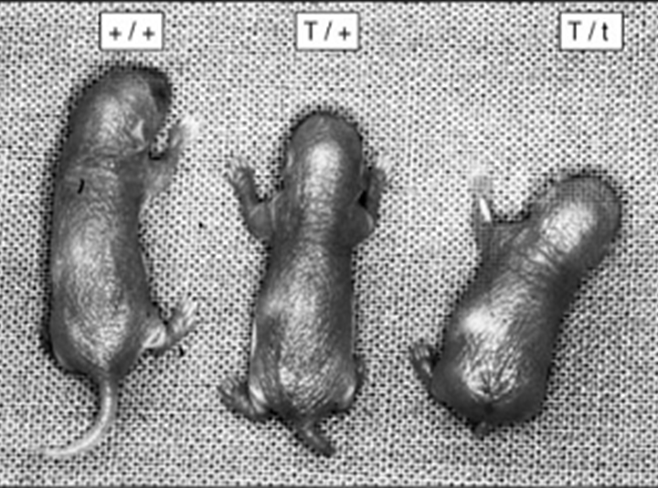
T 相对+是显性 t相对+是隐性
t/+ 正常 T/+ 尾巴短 -> t活性更高，所以能超过阈值

2. dominant negative
3. function mutations
	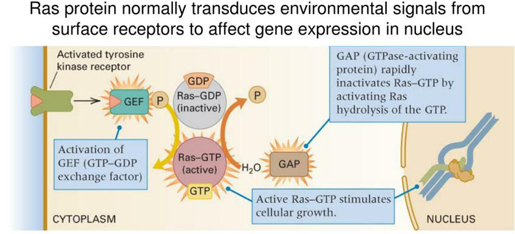
	癌症

### 复等位基因
ABO血型 1900
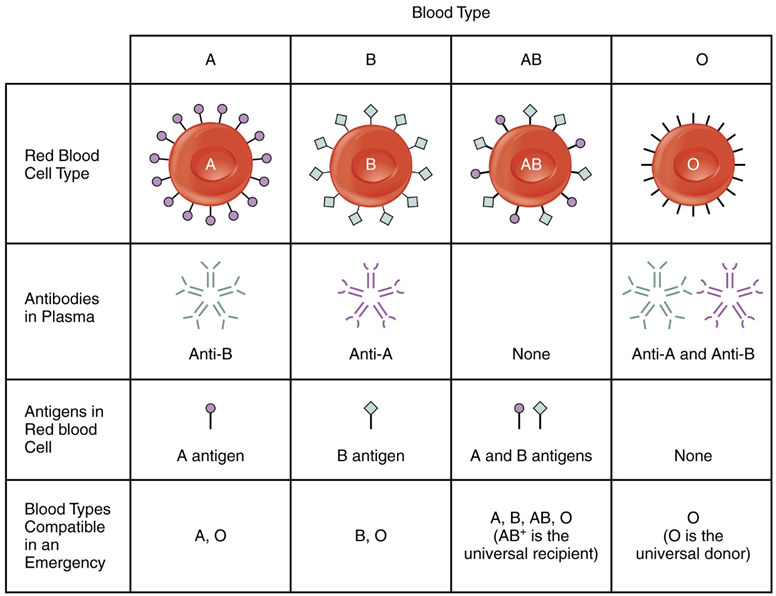
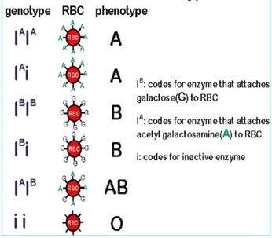
由以上分析可以得出4点结论：
（1）A型人之间，或者A型人与O型人婚配，其子女为 A型或O型；
（2）如果夫妇两人分别是A型和B型，其子女可以是任何血型；
（3）AB型的人与任何人婚配，都不会生出O型的子女.
（4）O型的人与任何人婚配，都不会生出AB型的子女。

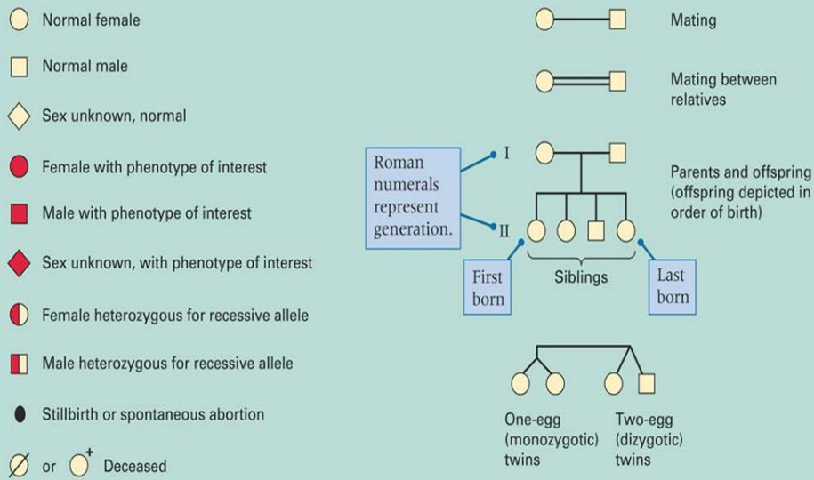
proband 先证者 --- 发现遗传病的人
孟买血型

## 非等位基因的相互作用
### 基因互作
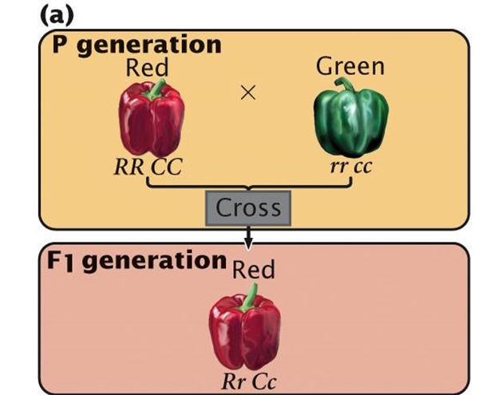
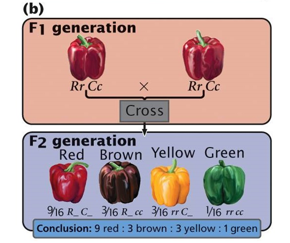
### 基因互补
两对非等位基因决定一种性状，仅当非等位基因的显性基因同时存在时才能表现显性表型，否则为隐性表型。
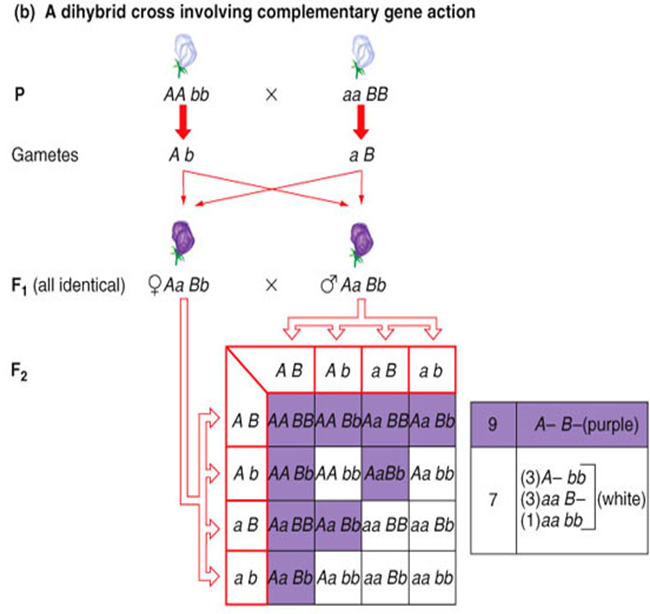
### 上位效应
两对非等位基因决定一种性状，一对基因影响了另一对非等位显性基因的表型。掩盖者称为上位基因，被掩盖者称为下位基因。
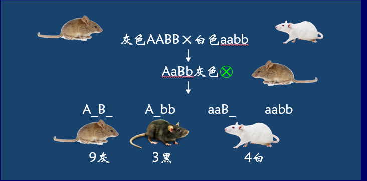
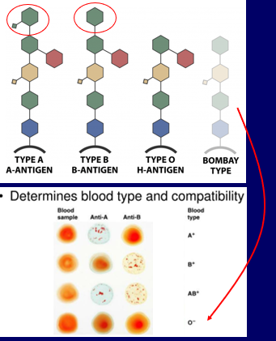
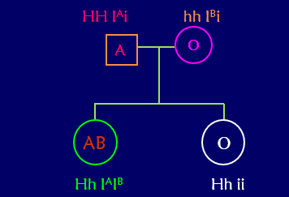
孟买血型 隐性上位

抑制作用
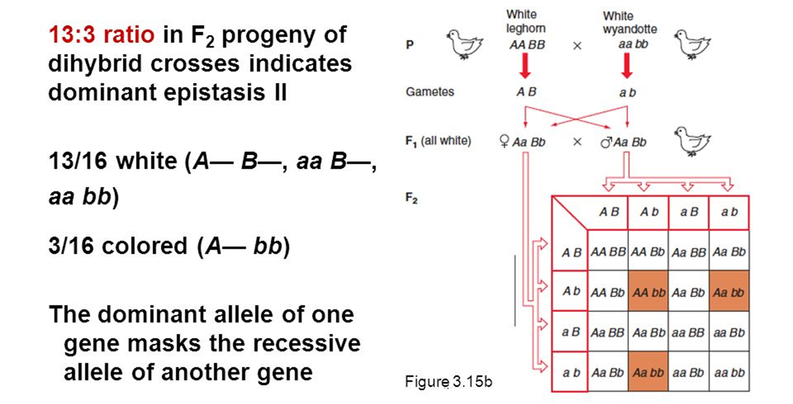
B抑制A，所以要有A无B

### 叠加效应
两个基因中只要有一个显性等位基因就可产生显性表型。

### 连续变化的性状
身高由至少4个基因决定 3^4种基因型

### 基因的多效性
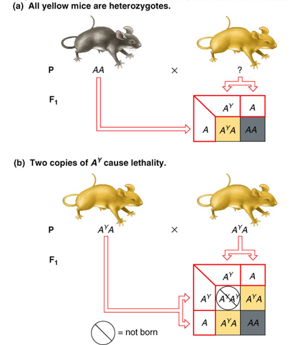
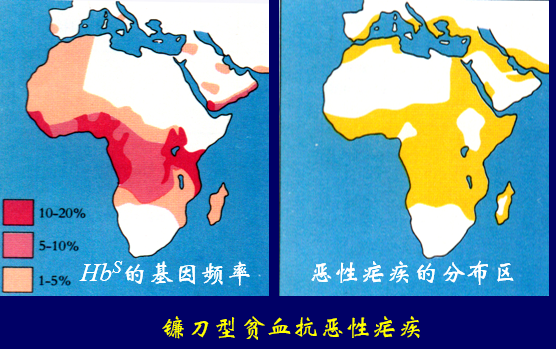

### 限性性状与从性性状
sex-limited trait 一种性相关遗传，基因位于常染色体或性染色体上，但性状仅在一种性别中表达，这些性状常和第二性征有关。
从性性状 sex-influenced traits 一种性相关遗传，基因位于常染色体上，但基因的表达和性激素有关，因此在不同性别中基因型相同，但表型不同。生物体某些受性别影响表现为显性或隐性的性状。（秃 男显性）

### 环境因素对表型

