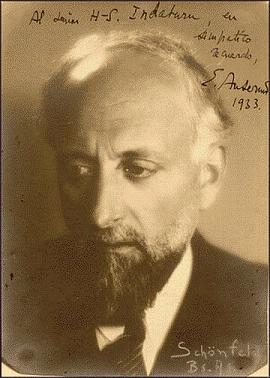

decca ultimate 是 decca 的一套古典音乐选集。

1. V.A. -《极致：拉赫玛尼诺夫选集》(Ultimate Rachmaninov)
2. V.A. -《极致：著名钢琴协奏曲选集》(Ultimate Piano Concertos)
3. V.A. -《极致：休闲古典名曲选集》(Ultimate Classical Relaxation)
4. V.A. -《极致：莫扎特选集》(Ultimate Mozart)
5. V.A. -《极致：小提琴古典名曲选集》(Ultimate Violin Classics)
6. V.A. -《极致：门德尔松选集》(Ultimate Mendelssohn)
7. V.A. -《极致：大提琴古典名曲选集》(Ultimate Cello Classics)
8. V.A. -《极致：肖邦选集》(Ultimate Chopin)
9. V.A. -《极致：巴洛克选集》(Ultimate Baroque)
10. V.A. -《极致：钢琴古典名曲选集》(Ultimate Classical Piano)
11. V.A. -《巴赫选集》(Ultimate Bach)
12. V.A. -《极致：柴科夫斯基选集》(Ultimate Tchaikovsky)
13. V.A. -《极致：贝多芬选集》(Ultimate Beethoven)
14. V.A. -《极致：亨德尔选集》(Ultimate Handel)
15. V.A. -《极致：古典名曲选集》(Ultimate Classics)
16. V.A. -《极致：威尔第选集》(Ultimate Verdi)
17. V.A. -《极致：维瓦尔第选集》(Ultimate Vivaldi)
18. V.A. -《极致：瓦格纳选集》(Ultimate Wagner)
19. V.A. -《极致：芭蕾舞曲选集》(Ultimate Ballet)
20. V.A. -《极致：舒伯特选集》(Ultimate Schubert)
21. V.A. -《极致：轻松古乐选集》(Ultimate Classical Chill Out)
22. V.A. -《极致：德沃夏克选集》(Ultimate Dvoak)
23. V.A. -《极致：施特劳斯家族选集》(Ultimate Strauss Family)
24. V.A. -《极致：李斯特选集》(Ultimate Liszt)
25. V.A. -《极致：歌剧选集》(Ultimate Opera)
26. V.A. -《极致：古典吉他名曲选集》(Ultimate Classical Guitar)
27. V.A. -《极致：海顿选集》(Ultimate Haydn)
28. V.A. -《极致：辉煌古典音乐选集》(Ultimate Classical Spectacular)
29. V.A. -《极致：梦幻古典音乐选集》(Ultimate Classical Dreams)
30. V.A. -《极致：普契尼选集》(Ultimate Puccini)
31. V.A. -《极致：勃拉姆斯选集》(Ultimate Brahms)
32. V.A. -《极致：柏辽兹选集》(Ultimate Berlioz)
33. V.A. -《极致：俄国古典音乐选集》(Ultimate Russian Classics)
34. V.A. -《极致：法国古典名曲选集》(Ultimate French Classics)

# 芭蕾

CD01 都是由来自瑞士的指挥家安塞美（[维基百科](https://zh.wikipedia.org/wiki/%E6%81%A9%E5%A5%88%E6%96%AF%E7%89%B9%C2%B7%E5%AE%89%E5%A1%9E%E7%BE%8E)）（法语：Ernest Alexandre Ansermet，法语发音：[[ɛʁ.nɛst a.lɛk.sɑ̃dʁ ɑ̃.sɛʁ.mɛ]](https://zh.wikipedia.org/wiki/Help:%E6%B3%95%E8%AA%9E%E5%9C%8B%E9%9A%9B%E9%9F%B3%E6%A8%99 "Help:法语国际音标")；1883年11月11日－1969年2月20日）指挥他自己创建的罗曼德管弦乐团。

Suisse Romande - Ansermet

曲目为：

1. 天鹅湖
2. 睡美人
3. 胡桃夹子

都是柴可夫斯基的作品。
